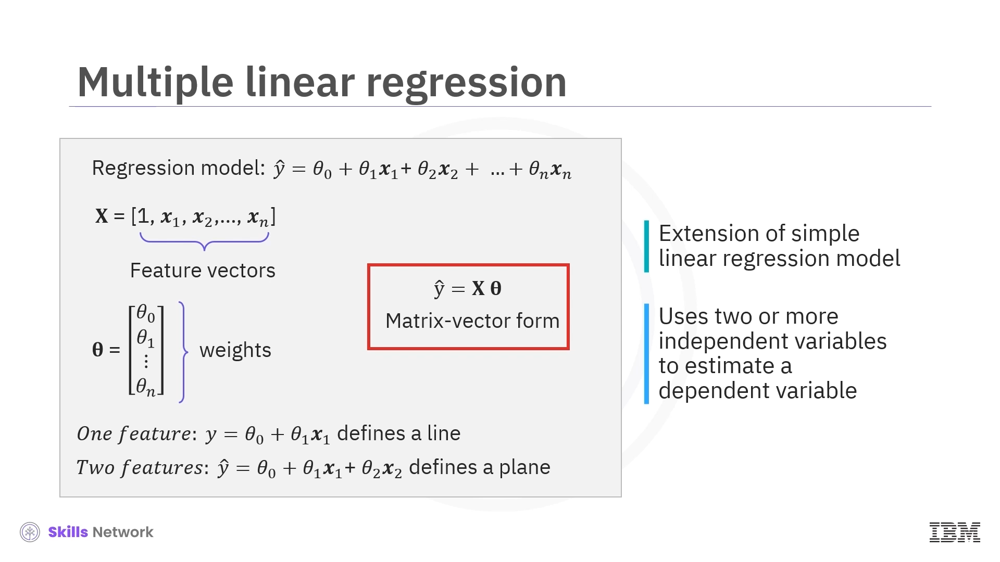
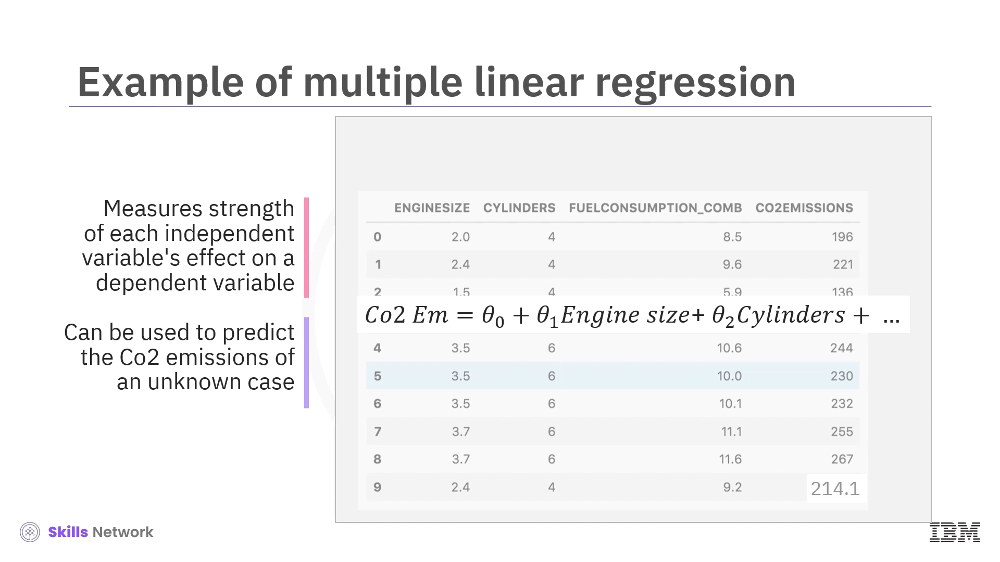

# Linear Regression

## Introduction to Regression

Regression is a type of supervised learning model. It models a relationship between a continuous target variable and explanatory features.

Consider this dataset related to CO2 emissions from different cars. The features in this dataset include engine size, number of cylinders, fuel consumption, and CO2 emissions from various automobile models. Given this dataset, is it possible to predict the CO2 emission of a new car from the listed features? The answer is yes. Using potentially predictive features, you can use regression to predict a continuous value, such as CO2 emissions.

Let's consider the previous dataset comprising some features in past cars. Then, from that data, a model can be trained to estimate the CO2 emissions of each car. Let's use regression to build such a predictive model. Then, the model is used to predict the expected CO2 emission for a new or hypothetical car.

### Types of regression

- **Simple Regression**: Simple regression is when a single independent variable estimates a dependent variable. Simple regression can be linear or nonlinear. For example, predicting CO2 emission using the variable engine size. Simple linear regression imposes a linear relationship between the dependent and independent variables. Similarly, nonlinear regression creates a nonlinear relationship between those variables.

- **Multiple Regression**: When more than one independent variable is present, the process is called multiple regression. The distinctions between linear and nonlinear relationships apply to simple and multiple regression. For example, predicting CO2 emission using engine size and the number of cylinders in any given car. Again, depending on the relation between dependent and independent variables, it can be either linear or nonlinear regression.

### Applications of Regression

Essentially, we use regression when we want to estimate a continuous value.

### Regression algorithms

There are many regression algorithms. Each algorithm is important in the appropriate context and suited to specific conditions. Linear and polynomial regression are classical statistical modeling methods, while random forest and XGBoost are modern machine learning regression models. Other modern regression algorithms include k-nearest neighbors, support vector machines, and neural networks.

## Simple Linear Regression

Linear regression models a linear relationship between a continuous target variable and explanatory features.

In simple linear regression, a single independent variable estimates the dependent variable.

With simple linear regression, you can determine a best-fit line through the data.

You can predict the target value, CO2 emissions, represented as the response variable, y-hat. The independent variable, which in this case is engine size, is represented by the single predictor variable, x1. The model is represented as the equation of a line. Here, y-hat is the predicted response expressed in terms of x1 using a y-intercept, theta zero, and a slope, theta one. Theta zero and theta one are called the coefficients of the linear regression model, selected by the linear regression algorithm to determine a best-fit line.

## Finding the best fit

Given a car with engine size x1 equals 5.4, its actual CO2 emission is 250, while its predicted emission is y-hat equals 340. Comparing the actual value to the predicted one, there's a 90-unit discrepancy. The residual error is the vertical distance from the data point to the fitted regression line. The average of all residual errors measures how poorly the regression line fits the data. Mathematically, it can be shown by the equation mean squared error, shown as MSE. Linear regression aims to find the line for minimizing the mean of all these residual errors. This form of regression is commonly known as ordinary least squares regression, or OLS regression.

## Estimating the coefficients of the linear regression model

We can use two formulas to calculate the coefficients theta zero and theta one of the linear regression model. It requires that we calculate the means, y-bar and x-bar, of the independent and dependent variables. The xi and yi in the equation for theta one refer to the ith values of x and y. Here, you can calculate the x-bar as 3.0 and the y-bar as 226.2.

For example, you can predict the CO2 emission from engine size for the automobile in record number 9 using the following equation. For an engine size of 2.4, we can predict that the CO2 emission of the car would be 214.

The OLS regression method is helpful because it's easy to understand and interpret. The method doesn't require any tuning and its solution is just a calculation. This also makes OLS regression fast, especially for smaller datasets. On the other hand, a linear model may be far too simplistic to capture complexity, such as a nonlinear relationship in the data. Outliers can greatly reduce its accuracy, giving them far too much weight in the calculations.

## Multiple Linear Regression
Multiple linear regression is an extension of the simple linear regression model. It uses two or more independent variables to estimate a dependent variable. Mathematically, the multiple regression model is a linear combination of the form y hat equals theta zero plus theta one x one, where the x one are the feature vectors that can be represented as a matrix x that includes a constant value of one in the first entry to account for the bias or intercept term theta underscore zero, and the thetas are the unknown weights, which can be represented as matrix theta.

You can predict the CO2 emission of a motor car from features like engine size, number of cylinders, and fuel consumption by forming a linear combination of the features using trained weights, theta i. You can use the trained model to predict the expected CO2 emission of an unknown case, such as record number 9. Multiple linear regression results in a better model than using a simple linear regression. However, adding too many variables can cause your model to overfit or essentially memorize the training data, making it a poor predictor for unseen observations. To improve prediction, categorical independent variables can be incorporated into a regression model by converting them into numerical variables. For example, given a binary variable such as car type, the code zero for manual and one for automatic cars can be substituted to make it numerical. For a categorical variable with more than two classes, you can opt to transform it into new Boolean features, one for each class.

Multiple linear regression has applications in every industry. It is widely used in the education sector to predict outcomes and explain relationships between variables. For example, do revision time, test anxiety, lecture attendance, and gender affect student exam performance? Multiple linear regression can also be used to predict the impact of changes in what-if scenarios. What-if scenarios involve hypothetical changes to one or more of your model's input features to see the predicted outcome. For example, suppose you were reviewing a person's health data. In that case, multiple linear regression might be able to tell you how much that person's blood pressure would rise or fall for every change in a patient's body mass index, BMI.

The what-if scenario can sometimes provide inaccurate findings in the following situations. You might consider impossible scenarios for your model to obtain predictions. You might extrapolate scenarios that are too distant from the realm of data it was trained on. Your model might depend on more than one variable amongst a group of correlated or collinear variables. When two variables are correlated, they are no longer independent variables because they are predictors of each other. They are collinear. You can perform a what-if scenario with a linear regression model by changing a single variable while holding all other variables constant. However, if the variable is correlated with another feature, then this is not feasible because the other variable must also change realistically. The solution for avoiding pitfalls from correlated variables is to remove any redundant variables from the regression analyses.

To build your multiple regression model, you must select your variables using a balanced approach considering uncorrelated variables, which are most understood, controllable, and most correlated with the target. Multiple linear regression assigns a relative importance to each feature. Imagine you are predicting CO2 emission, or Y, from other variables for the automobile in record number 9. Once you find the parameters, you can plug them into the linear model equation model. For example, let's use theta 0 equals 125, theta 1 equals 6.2, theta 2 equals 14, and so on. If we map these values to our dataset, we can rewrite the linear model as CO2 emission equals 125 plus 6.2, multiplied by engine size plus 14, multiplied by cylinder, and so on. Now, let's plug in the 9th row of R and calculate the CO2 emissions for a car with a 2.4L engine. So CO2 emission equals 125 plus 6.2 times 2.4 plus 14 times 4, and so on. We can predict the CO2 emission for this specific car will be 214.1.

For a simple linear regression, where there is only one feature vector, the regression in the equation defines a line. For multiple linear regression using two features, the solution describes a plane. Beyond two dimensions, it describes a hyperplane. Like with simple linear regression, the values in the weight vector theta can be determined by minimizing the mean square prediction error. Given a set of parameters, consider a linear model based on the linear combination of the parameters with the features. You can measure the residual error for each car in the dataset as the difference between its true CO2 emission value and the value predicted by the model. For example, if the model predicts 140 as the value for the first car in the dataset, using the actual value of 196, you can see the residual error is 196 minus 140, or 56.

The average of all the residual errors indicates how poorly the model predicts the actual values. This information is called the mean squared error, or MSE. MSE is not the only way to expose the error of a linear model. However, it is the most popular. With this metric, the best model for the dataset is the one with the least squared error. The factor of 1 slash n in the MSE equation isn't necessary to include to minimize the error, so this method is called least squares linear regression. So, multiple linear regression aims to minimize the MSE equation by finding the best parameters. There are many ways to estimate the value of these coefficients. However, ordinary least squares and an optimization approach are the most common methods. Ordinary least squares estimate the values of the coefficients by minimizing the mean squared error. This approach uses the data as a matrix and uses linear algebra operations to calculate the optimal values for theta. Another option is to use an optimization algorithm to find the best parameters. That is, you can use a process of optimizing the coefficients by iteratively minimizing the model's error on your training data. For example, you can use the gradient descent method, which starts the optimization with random values for each coefficient. Gradient descent is a good approach if you have a large dataset.

Multiple linear regression is an extension of the simple linear regression model. It uses two or more independent variables to estimate a dependent variable. It is widely used in the education sector to predict outcomes and explain relationships between variables. Multiple linear regression can also be used to predict the impact of changes in what-if scenarios. Adding too many variables can cause your model to overfit or essentially memorize the training data, making it a poor predictor for unseen observations. To build your multiple regression model, you must select your variables using a balanced approach, considering uncorrelated variables, which are most understood, controllable, and most correlated with the target. There are many ways to estimate the parameters for multiple linear regression. However, ordinary least squares and an optimization with random values approach are the most common methods. In this video, you learned how multiple linear regression results in a better model than using a simple linear regression.

# Introduction to Nonlinear Regression

- **Nonlinear regression** is a statistical method used to model the relationship between a dependent variable and one or more independent variables.
- This relationship is represented by a **nonlinear equation**, which can be polynomial, exponential, logarithmic, or any function that doesn't use linear parameters.
- It is particularly useful for modeling **complex relationships** between variables that cannot be accurately captured by a straight line.
- In many real-world scenarios, data follows a smoothed curve rather than a straight line, making a nonlinear curve a better fit. A straight line in such cases would underfit the data.
- An example of data that would use nonlinear regression is a dataset following an **exponential growth pattern**.

# Understanding Polynomial Regression

- **Polynomial regression** is considered a special type of nonlinear regression. It models the relationship between an independent variable (x) and a dependent variable (y) as an **nth-degree polynomial** in x.
- It works by using ordinary linear regression to fit data to polynomial expressions of the features, rather than the features themselves.
- While it expresses a nonlinear dependence on the input features, it has a **linear dependence on the regression coefficients**.
- Because of this, it can be transformed into a linear regression problem and is often simply referred to as linear regression.
- For example, a cubic (third-degree) polynomial  
  `y = θ₀ + θ₁x + θ₂x² + θ₃x³`  
  can be transformed into a linear model.
- By introducing new variables (e.g., `x₁ = x`, `x₂ = x²`, `x₃ = x³`), the equation becomes a linear combination:  
  `y = θ₀ + θ₁x₁ + θ₂x₂ + θ₃x₃`.
- This linearized model allows the use of **ordinary multiple linear regression** to find the best-fit parameters.

# The Risk of Overfitting in Polynomial Regression

- For any finite set of data points, it's always possible to find a polynomial of a high enough degree to pass through every single point.
- However, achieving a perfect fit this way amounts to **overfitting**.
- When a model overfits, it **memorizes everything**, including random noise and large variations, instead of understanding the underlying patterns in the data.
- It is crucial to select a regression model that fits the data well without overfitting, capturing the general trend rather than every minor detail.

# Common Examples of Nonlinear Regression Models

Many complex real-world relationships cannot be modeled using polynomials. Common examples include:

- **Exponential or Compound Growth**: Seen where the rate of growth itself increases over time.  
  - *Example*: The growth of investments with compound interest rates.  
  - *Example*: China's GDP from 1960 to 2014 showed a strong, nonlinear exponential growth pattern. A suitable model could be an exponential function like `ŷ = θ₀ + θ₁e^x`.

- **Logarithmic**: Often used to represent the law of diminishing returns.  
  - *Example*: As investment in a production factor like labor increases, the incremental gains in productivity can decrease.  
  - *Example*: A simulation of human productivity shows that after a certain number of hours worked (e.g., 6 hours), each extra hour generates less productivity than the previous one, with returns becoming logarithmic.

- **Periodicity**: Used for data that exhibits seasonal or cyclical variations.  
  - *Example*: Sinusoidal patterns in data like monthly rainfall or temperature.

# How to Find the Right Regression Model

- There are multiple methods to determine which regression model is most appropriate for your data.
- One effective technique is to **visually analyze scatter plots** of your target variable against each input variable to identify patterns.
- Based on these visual patterns, you can try to express the relationships using mathematical functions to see if they appear linear, exponential, logarithmic, or sinusoidal.
- You can also visually interpret your model's performance by plotting its predictions against the actual target values to check the errors.
- It is also possible that your data has no relationship with your target variable.

# Finding an Optimal Nonlinear Model

- If you have a specific mathematical expression for your proposed model, you can use an optimization technique like **gradient descent** to find the optimal parameters.
- If you have not decided on a specific regression model, you can choose from various **machine learning models**.
- Some of these models include **regression trees, random forests, neural networks, support vector machines, gradient boosting machines, and k-nearest neighbors**.
