# Linear Regression
## Introduction to Regression
Regression is a type of supervised learning model. It models a relationship between a continuous target variable and explanatory features.

Consider this dataset related to CO2 emissions from different cars. The features in this dataset include engine size, number of cylinders, fuel consumption, and CO2 emissions from various automobile models. Given this dataset, is it possible to predict the CO2 emission of a new car from the listed features? The answer is yes. Using potentially predictive features, you can use regression to predict a continuous value, such as CO2 emissions.

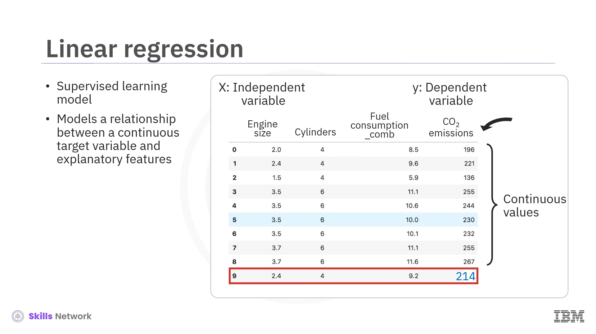

Let's consider the previous dataset comprising some features in past cars. Then, from that data, a model can be trained to estimate the CO2 emissions of each car. Let's use regression to build such a predictive model. Then, the model is used to predict the expected CO2 emission for a new or hypothetical car.

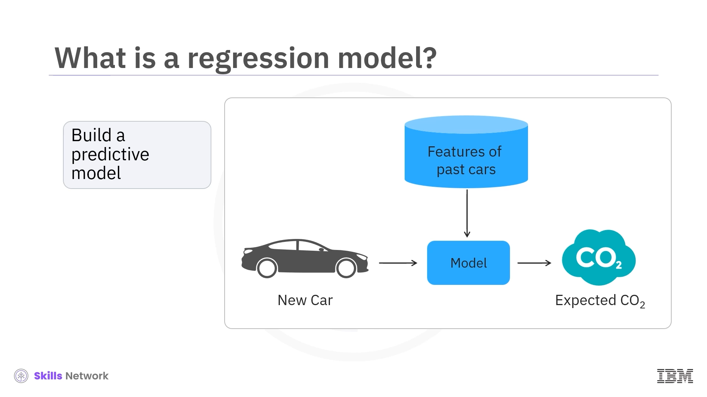

### Types of regression

- **Simple Regression**: Simple regression is when a single independent variable estimates a dependent variable. Simple regression can be linear or nonlinear. For example, predicting CO2 emission using the variable engine size. Simple linear regression imposes a linear relationship between the dependent and independent variables. Similarly, nonlinear regression creates a nonlinear relationship between those variables.

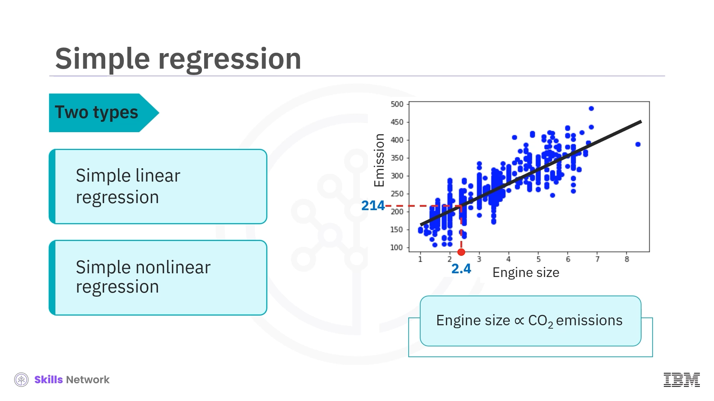

- **Multiple Regression**: When more than one independent variable is present, the process is called multiple regression. The distinctions between linear and nonlinear relationships apply to simple and multiple regression. For example, predicting CO2 emission using engine size and the number of cylinders in any given car. Again, depending on the relation between dependent and independent variables, it can be either linear or nonlinear regression.

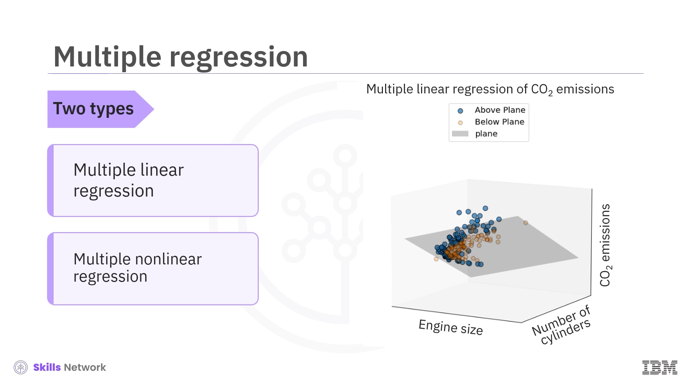

### Applications of Regression
Essentially, we use regression when we want to estimate a continuous value.

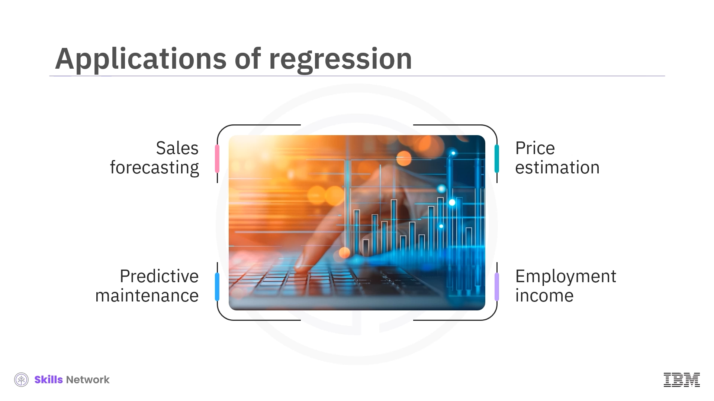
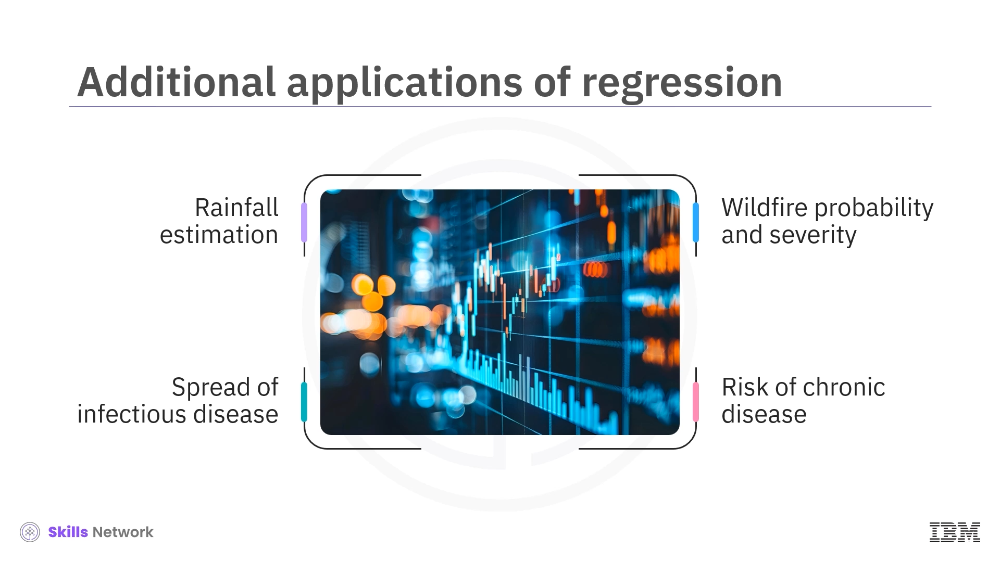

### Regression algorithms
There are many regression algorithms. Each algorithm is important in the appropriate context and suited to specific conditions. Linear and polynomial regression are classical statistical modeling methods, while random forest and XGBoost are modern machine learning regression models. Other modern regression algorithms include k-nearest neighbors, support vector machines, and neural networks.

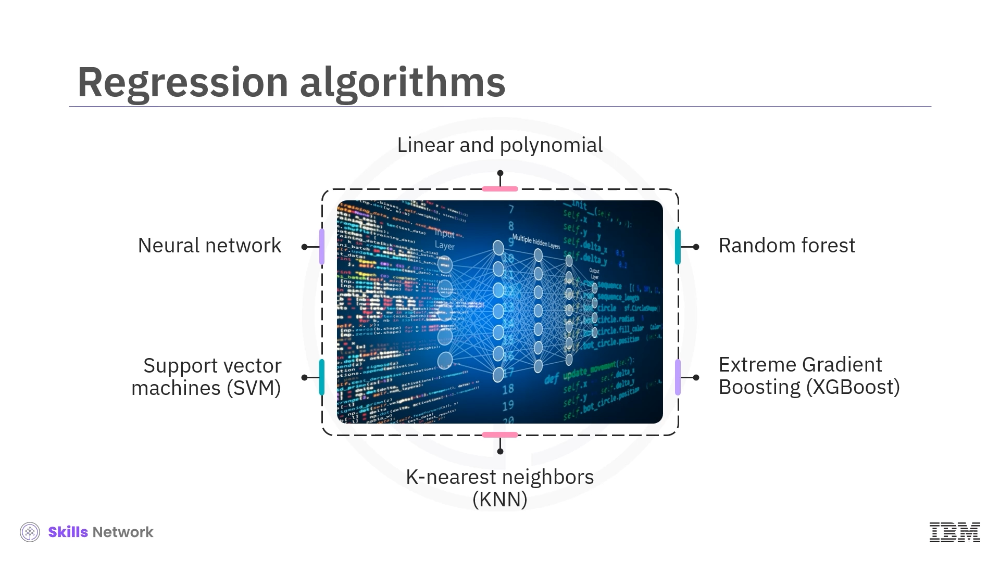

## Simple Linear Regression
Linear regression models a linear relationship between a continuous target variable and explanatory features.

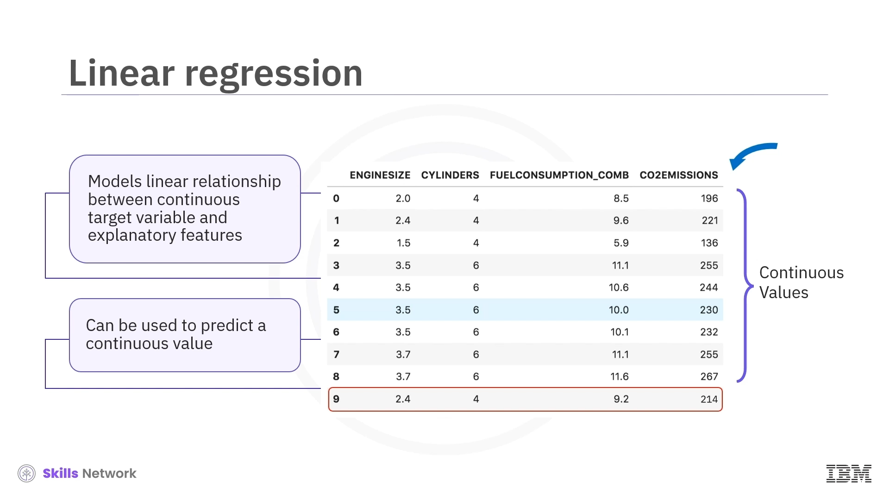

In simple linear regression, a single independent variable estimates the dependent variable.

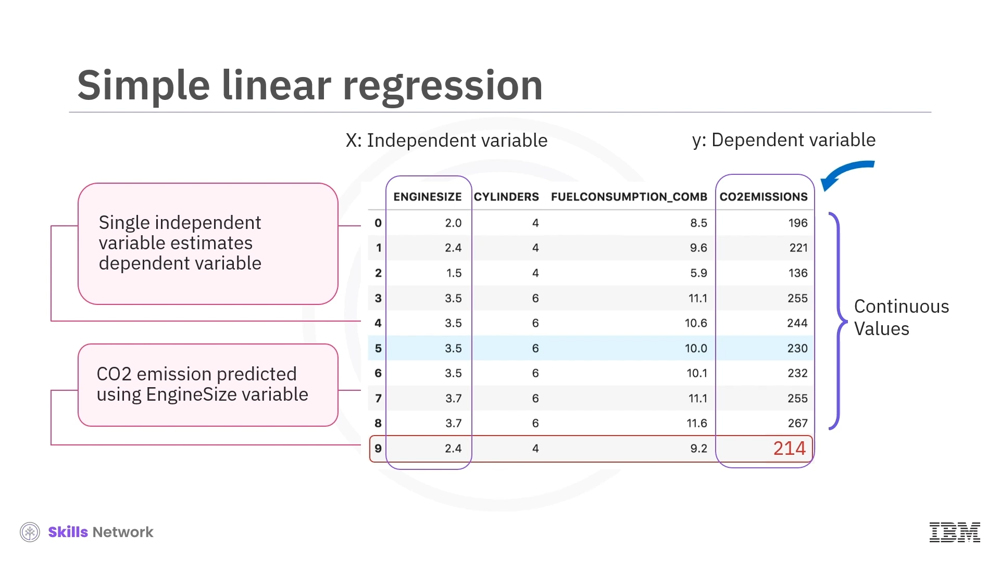

With simple linear regression, you can determine a best-fit line through the data.

You can predict the target value, CO2 emissions, represented as the response variable, y-hat. The independent variable, which in this case is engine size, is represented by the single predictor variable, x1. The model is represented as the equation of a line, here. y-hat is the predicted response expressed in terms of x1 using a y-intercept, theta zero, and a slope, theta one. Theta zero and theta one are called the coefficients of the linear regression model, selected by the linear regression algorithm to determine a best-fit line.

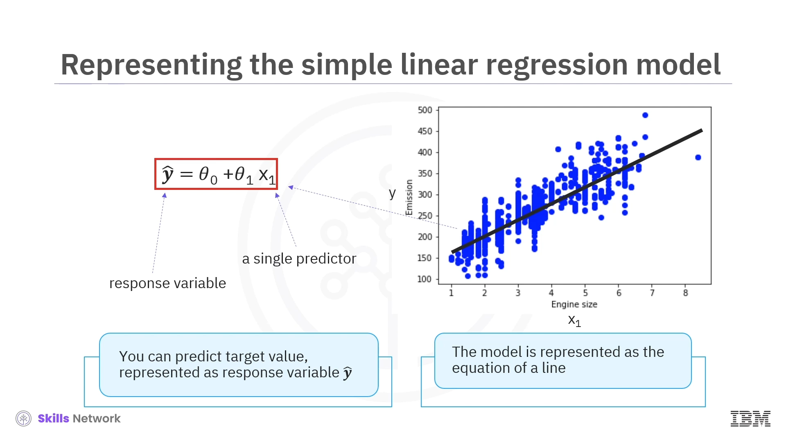

## Finding the best fit
Given a car with engine size x1 equals 5.4, its actual CO2 emission is 250, while its predicted emission is y-hat equals 340. Comparing the actual value to the predicted one, there's a 90-unit discrepancy. The residual error is the vertical distance from the data point to the fitted regression line. The average of all residual errors measures how poorly the regression line fits the data. Mathematically, it can be shown by the equation mean squared error, shown as MSE. Linear regression aims to find the line for minimizing the mean of all these residual errors. This form of regression is commonly known as ordinary least squares regression, or OLS regression.

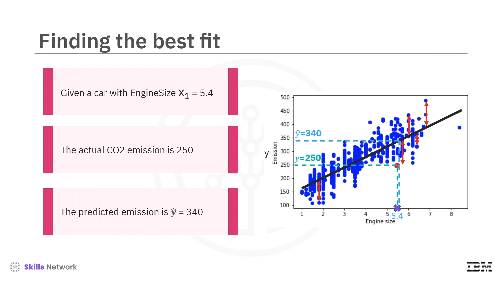

## Estimating the coefficients of the linear regression model

We can use two formulas to calculate the coefficients theta zero and theta one of the linear regression model. It requires that we calculate the means, y-bar and x-bar, of the independent and dependent variables. The xi and yi in the equation for theta one refer to the ith values of x and y. Here, you can calculate the x-bar as 3.0 and the y-bar as 226.2.

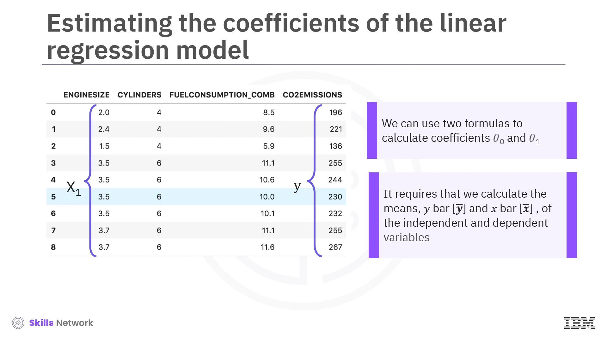

For example, you can predict the CO2 emission from engine size for the automobile in record number 9 using the following equation. For an engine size of 2.4, we can predict that the CO2 emission of the car would be 214.

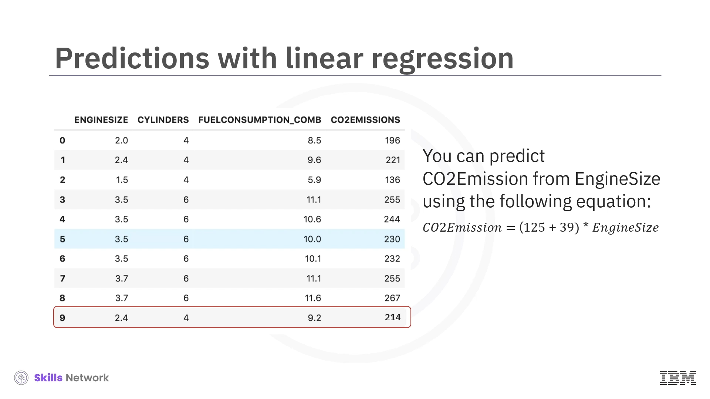

The OLS regression method is helpful because it's easy to understand and interpret. The method doesn't require any tuning and its solution is just a calculation. This also makes OLS regression fast, especially for smaller datasets. On the other hand, a linear model may be far too simplistic to capture complexity, such as a nonlinear relationship in the data. Outliers can greatly reduce its accuracy, giving them far too much weight in the calculations.

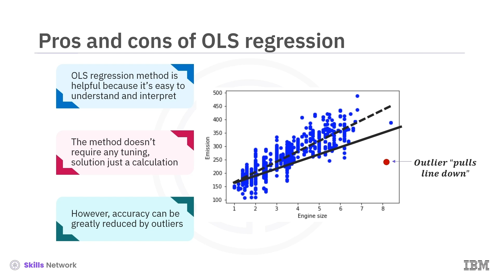