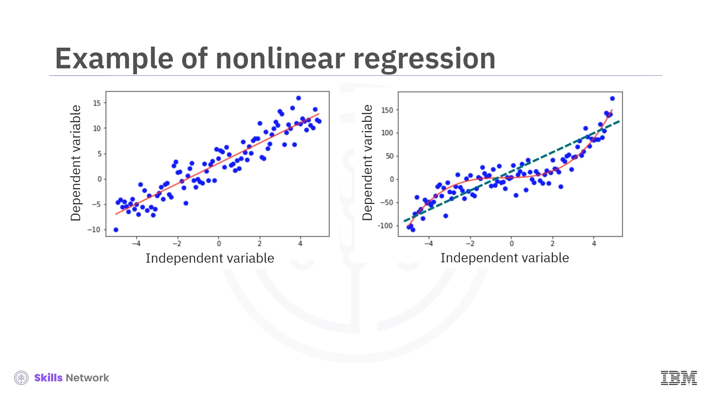

# Polynomial and Non-Linear Regression

# Introduction to Nonlinear Regression

- **Nonlinear regression** is a statistical method used to model the relationship between a dependent variable and one or more independent variables.
- This relationship is represented by a **nonlinear equation**, which can be polynomial, exponential, logarithmic, or any function that doesn't use linear parameters.
- It is particularly useful for modeling **complex relationships** between variables that cannot be accurately captured by a straight line.
- In many real-world scenarios, data follows a smoothed curve rather than a straight line, making a nonlinear curve a better fit. A straight line in such cases would underfit the data.
- An example of data that would use nonlinear regression is a dataset following an **exponential growth pattern**.

# Understanding Polynomial Regression

- **Polynomial regression** is considered a special type of nonlinear regression. It models the relationship between an independent variable (x) and a dependent variable (y) as an **nth-degree polynomial** in x.
- It works by using ordinary linear regression to fit data to polynomial expressions of the features, rather than the features themselves.
- While it expresses a nonlinear dependence on the input features, it has a **linear dependence on the regression coefficients**.
- Because of this, it can be transformed into a linear regression problem and is often simply referred to as linear regression.
- For example, a cubic (third-degree) polynomial`y = θ₀ + θ₁x + θ₂x² + θ₃x³`
can be transformed into a linear model.
- By introducing new variables (e.g., `x₁ = x`, `x₂ = x²`, `x₃ = x³`), the equation becomes a linear combination:`y = θ₀ + θ₁x₁ + θ₂x$_2$ + θ₃x$_3$`.

- This linearized model allows the use of **ordinary multiple linear regression** to find the best-fit parameters.

## The Risk of Overfitting in Polynomial Regression

- For any finite set of data points, it's always possible to find a polynomial of a high enough degree to pass through every single point.
- However, achieving a perfect fit this way amounts to **overfitting**.
- When a model overfits, it **memorizes everything**, including random noise and large variations, instead of understanding the underlying patterns in the data.
- It is crucial to select a regression model that fits the data well without overfitting, capturing the general trend rather than every minor detail.

## Common Examples of Nonlinear Regression Models

Many complex real-world relationships cannot be modeled using polynomials. Common examples include:

- **Exponential or Compound Growth**: Seen where the rate of growth itself increases over time.
    - *Example*: The growth of investments with compound interest rates.
    - *Example*: China's GDP from 1960 to 2014 showed a strong, nonlinear exponential growth pattern. A suitable model could be an exponential function like `ŷ = θ₀ + θ₁e^x`.
- **Logarithmic**: Often used to represent the law of diminishing returns.
    - *Example*: As investment in a production factor like labor increases, the incremental gains in productivity can decrease.
    - *Example*: A simulation of human productivity shows that after a certain number of hours worked (e.g., 6 hours), each extra hour generates less productivity than the previous one, with returns becoming logarithmic.
- **Periodicity**: Used for data that exhibits seasonal or cyclical variations.
    - *Example*: Sinusoidal patterns in data like monthly rainfall or temperature.

## How to Find the Right Regression Model

- There are multiple methods to determine which regression model is most appropriate for your data.
- One effective technique is to **visually analyze scatter plots** of your target variable against each input variable to identify patterns.
- Based on these visual patterns, you can try to express the relationships using mathematical functions to see if they appear linear, exponential, logarithmic, or sinusoidal.
- You can also visually interpret your model's performance by plotting its predictions against the actual target values to check the errors.
- It is also possible that your data has no relationship with your target variable.

## Finding an Optimal Nonlinear Model

- If you have a specific mathematical expression for your proposed model, you can use an optimization technique like **gradient descent** to find the optimal parameters.
- If you have not decided on a specific regression model, you can choose from various **machine learning models**.
- Some of these models include **regression trees, random forests, neural networks, support vector machines, gradient boosting machines, and k-nearest neighbors**.

# What is Logistic Regression?

Logistic regression is a statistical modeling technique used in machine learning. It serves a dual role as both a **probability predictor and a binary classifier**. Its primary function is to predict the probability that an observation belongs to one of two possible classes, such as true/false or 1/0.

- **As a Probability Predictor**: It calculates the likelihood of a specific outcome. For example, it can determine the probability that a customer will churn or that a patient has a certain disease.
- **As a Binary Classifier**: By setting a threshold probability (e.g., 0.5), the model can assign each observation to a specific class. If the calculated probability is above the threshold, it is assigned to one class; if below, it is assigned to the other. In machine learning, logistic regression specifically refers to this binary classifier function.

## When to Use Logistic Regression

Logistic regression is a suitable choice under several specific conditions:

- **When the target variable is binary**: The outcome you want to predict can be categorized into two distinct classes, typically represented as 0 and 1.
- **When you need the probability of an outcome**: It is ideal for situations where you need to know the likelihood of an event occurring, such as the probability of a customer buying a product.
- **When data is linearly separable**: For this type of data, the decision boundary of the logistic regression model is a line, plane, or hyperplane.
- **When you want to understand feature impact**: The model allows you to assess the influence of each independent feature by examining the size of its model coefficients, or weights. This helps in selecting the most impactful features for the model.

## Examples and Applications

Logistic regression can be used to model the probability of many real-world events:

- **Medical Predictions**:
    - Predicting the probability that a person will have a heart attack based on their age, sex, and body mass index.
    - Estimating the chance that a disease like diabetes might appear based on a patient's weight, height, blood pressure, and blood test results.
- **Business and Finance**:
    - Calculating the likelihood that a customer of a subscription service will churn (cancel their subscription). An example involves using a telecommunication dataset with historical customer data—including services, account information, and demographics—to predict which customers will leave. In this case, 'churn' is the dependent variable you are trying to predict.
    
    
    
    - Determining the likelihood of a homeowner defaulting on a mortgage.
- **Process and Product Reliability**:
    - Estimating the probability of failure for a given process, system, or product.

## How the Model Works

The goal of logistic regression is to build a model that predicts a class by first calculating a probability. It achieves this by using the sigmoid function to transform the output of a linear equation.

### Limitations of Linear Regression for Classification

You cannot directly use a standard linear regression model (e.g., `y-hat = θ₀ + θ₁x₁`) for binary classification.

- **Unbounded Output**: A linear model's output is not confined between 0 and 1, so it cannot represent a probability. The predicted value can increase or decrease indefinitely as the input feature's value changes.
- **Insensitive Thresholding**: If you apply a simple threshold (like 0.5) to the linear output to force a classification, it creates a "step function". This approach loses valuable information because it treats all values above the threshold as identical (e.g., an output of 0.6 is treated the same as 5.0) and doesn't provide the actual probability of belonging to a class.

## The Sigmoid (Logit) Function

To solve these issues, logistic regression uses the **sigmoid function**, also known as the logit function.

- **Definition**: The function is defined as **`σ(x) = 1 / (1 + e⁻ˣ)`**.
- **Functionality**: It takes any continuous input value and "compresses" it into a value **between 0 and 1**, which can then be interpreted as a probability.
- **Behavior**:
    - As the input `x` gets larger, the function's output approaches 1.
    - As the input `x` becomes more negative, the output approaches 0.
    - When the input `x` is 0, the sigmoid function outputs 0.5.

## From Input to Probability

The logistic regression model uses the sigmoid function on a linear combination of the input features.

- The output, `p-hat`, represents the **predicted probability that the class `y` is 1**, given the input data `x`.

- The probability of the other outcome (that `y` is 0) is simply **1 minus the churn probability**, as the two probabilities must sum to 1. For example, if the model predicts the probability of a customer churning is 0.8, then the probability of that customer staying is 1 - 0.8 = 0.2.

## From Probability to Classification

Once the model calculates a probability, it can be used as a binary classifier by defining a **decision boundary**.

- A **threshold** is chosen, often 0.5.
- If the predicted probability for an observation is greater than the threshold, it is assigned to class 1.
- If the probability is less than the threshold, it is assigned to class 0.

## The Goal of Training a Logistic Regression Model

The main objective of training a logistic regression model is to **find the best set of parameters, also known as theta (θ), that can map input features to target outcomes with the minimum possible error**. An optimization step is required to find these best parameters. The process aims to create a model that can predict classes with high accuracy. While a preliminary model can be created after an initial pass, it is not considered the best model until this optimization is complete.

### The Training Process

The training process is an iterative procedure designed to find the optimal set of parameters (theta) that minimizes a cost function. The steps are as follows:

1. **Initialize Parameters**: Begin by choosing a starting set of parameters (theta), which can be a random choice.
2. **Predict Probabilities**: Use the current parameters to predict the probability that the class is 1 for every observation in your dataset.
3. **Measure Error**: Calculate the error between the predicted classes and the actual classes using a **cost function** called log loss.
4. **Update Parameters**: Determine a new set of theta values that reduces the prediction error.
5. **Repeat**: Continue this process until the log loss value is small enough to be satisfactory or until a specified maximum number of iterations has been reached.

## The Cost Function: Log Loss

To determine the best model, a metric is needed to measure its goodness of fit for a given set of parameters. In logistic regression, this metric is a cost function called **log loss**, which the training process seeks to minimize.

- **What it Measures**: Log loss quantifies how well the model's predicted probabilities (`p-hat`) match the actual classes (`y`).

### **How it Works**:

- Log loss **favors confident and correct classifications**. For example, if the model correctly predicts a high probability (e.g., close to 1) for an observation that is actually class 1, the log loss will be small.
- Conversely, it heavily **penalizes confident but incorrect predictions**. If the model predicts a high probability for class 1 but the actual class is 0, the log loss will be very large.
- **The Formula**: The log loss is defined as the negative average of the sum of two terms for each observation (`i`) in a dataset of `N` rows:
    
    
    
    - The negative sign is included because the logarithm of a value between 0 and 1 is always negative.

## Optimization with Gradient Descent

Gradient descent is a popular and clever iterative method used to find the minimum of a function, which in this case is the log loss cost function.

- **Objective**: The primary goal of gradient descent is to systematically change the parameter values (theta) to find a path to the optimal parameters that minimize the cost function.
- **How it Works**:
    - It uses the derivative of the log loss function to determine the direction of the **steepest descent**. The algorithm adjusts the parameter values in this direction.
    - Imagine the cost function as a surface or a bowl. The gradient points uphill (steepest ascent), so the negative of the gradient points downhill (steepest descent).
    - The algorithm takes steps towards the minimum, with the step size determined by two factors: the steepness of the slope (the greater the slope, the larger the step) and a scaling factor called the **learning rate**.
    - The learning rate is a specified value that controls how large of a step is taken during each iteration.
    - As the algorithm approaches the lowest point of the surface, the slope decreases to zero, and the optimal parameters are found.
    
    
    
- **Limitation**: Standard gradient descent calculates the gradient of the cost function over the **entire dataset** for each iteration. This can become very slow when working with large datasets. Simply increasing the learning rate to speed it up is risky, as the steps might become too large and overshoot the minimum.

## Stochastic Gradient Descent (SGD)

Stochastic Gradient Descent (SGD) is a variation of the gradient descent algorithm that addresses the speed issue of standard gradient descent, especially for large datasets.

- **How it Works**: Instead of using the entire dataset to calculate the gradient, SGD approximates it by using a **random subset of the training data** for each iteration.
- **Advantages**:
    - It is **faster** and scales well to large datasets.
    - It is more likely to avoid getting stuck in local minima and can find the global minimum of the cost function.
- **Disadvantages and Improvements**:
    - While SGD converges quickly towards a global minimum, it can sometimes wander around it without settling perfectly. It can also be less accurate than standard gradient descent.
    - This convergence can be improved by gradually **decreasing the learning rate** as the algorithm gets closer to the minimum or by **gradually increasing the size of the random data sample** used to calculate the gradient.
    
    
    

# Summary and Highlights

- Regression models relationships between a continuous target variable and explanatory features, covering simple and multiple regression types.
- Simple regression uses a single independent variable to estimate a dependent variable, while multiple regression involves more than one independent variable.
- Regression is widely applicable, from forecasting sales and estimating maintenance costs to predicting rainfall and disease spread.
- In simple linear regression, a best-fit line minimizes errors, measured by Mean Squared Error (MSE); this approach is known as Ordinary Least Squares (OLS).
- OLS regression is easy to interpret but sensitive to outliers, which can impact accuracy.
- Multiple linear regression extends simple linear regression by using multiple variables to predict outcomes and analyze variable relationships.
- Adding too many variables can lead to overfitting, so careful variable selection is necessary to build a balanced model.
- Nonlinear regression models complex relationships using polynomial, exponential, or logarithmic functions when data does not fit a straight line.
- Polynomial regression can fit data but may overfit by capturing random noise rather than underlying patterns.
- Logistic regression is a probability predictor and binary classifier, suitable for binary targets and assessing feature impact.
- Logistic regression minimizes errors using log-loss and optimizes with gradient descent or stochastic gradient descent for efficiency.
- Gradient descent is an iterative process to minimize the cost function, which is crucial for training logistic regression models.