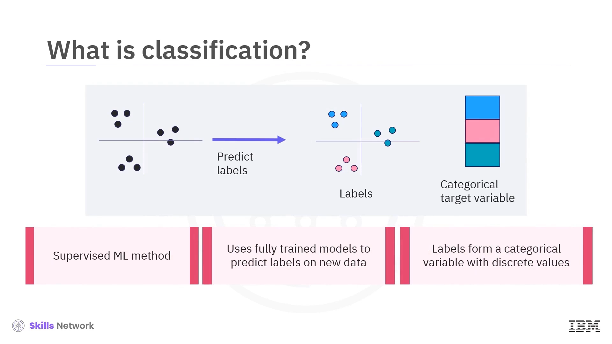
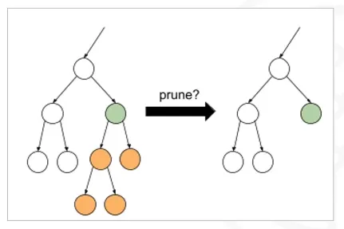
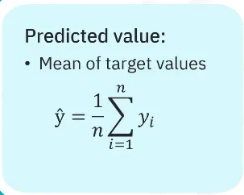
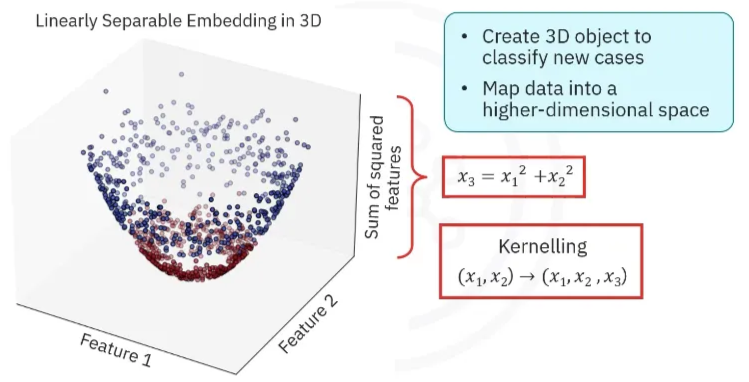

# Building Supervised Learning Models

# **What is Classification?**

Classification is a **supervised machine learning (ML) method** that utilizes fully trained models to assign categorical labels to new data. The labels represent a categorical variable with distinct, separate values.

As a form of supervised learning, its objective is to understand data within the correct context to answer a specific question, which helps ensure accuracy when making predictions. When new data is fed into a classification model, the model adjusts the data to align with its algorithm and then classifies it, defining both the input and the resulting predicted output.

# **Applications and Use Cases**

Classification has a wide array of applications across many industries, especially when labeled data is available to establish connections between feature and target variables.

## **General Applications:**

- Email filtering
- Speech-to-text conversion
- Handwriting recognition
- Biometric identification
- Document classification

## **Specific Use Cases:**

- **Churn Prediction:** Using classification to predict whether a customer will stop using a service.
- **Customer Segmentation:** Predicting the category a customer belongs to.
- **Advertising Campaign Response:** Forecasting if a customer is likely to respond to a marketing campaign.
- **Loan Default Prediction:** This is an example of a **binary classifier**, where predictions are limited to two classes. A bank can use historical data on loan defaults to train a model. The classifier uses customer information like age, income, and credit debt to learn the characteristics of those who default. It can then predict whether a new applicant is likely to default on their loan.

- **Multi-Class Drug Prescription:** This is an example of a **multi-class classifier**. By collecting data from a group of patients with the same illness who responded positively to one of three different medications, a classification model can be built. This model can then predict which of the three drugs would be most appropriate for a new patient with the same illness.

## **Classification Algorithms**

There are many different algorithms available to build a classification model. Some of the most common ones include:

- Naive Bayes
- Logistic Regression
- Decision Trees
- K-Nearest Neighbors (KNN)
- Support Vector Machines
- Neural Networks

Algorithms such as **Logistic Regression, KNN, and Decision Trees are capable of learning how to differentiate between multiple classes directly**.

## **Making Multi-Class Predictions**

Many classification algorithms are inherently binary, meaning they can only distinguish between two classes. However, these binary classifiers can be extended to handle multi-class problems using specific strategies.

**1. One-Versus-All (or One-Versus-the-Rest) Strategy:**

- **How it works:** This method implements a set of independent binary classifiers, with one classifier for each class label in the dataset. If there are 'k' classes, there will be exactly 'k' binary classifiers.

- **The Task:** Each classifier is assigned a single label and its job is to make a binary prediction for every data point, determining whether it has that specific label. The algorithm processes each class label one at a time.
- **Unique Feature:** A data point might not be picked up by any of the individual classifiers. Such points are considered unclassified and fall into another class, a feature that can be useful for **identifying outliers or noise** in the data.

**2. One-Versus-One Strategy:**

- **The Core Question:** This strategy changes the question from "Is it this?" to **"Is it this or is it that?"**.
- **How it works:** The algorithm considers all possible pairs of classes. For each pair, a classifier is trained on the data subset corresponding only to those two labels. This classifier then decides which of the two classes each data point belongs to. This process is repeated until classifiers for all pairs have been trained.

- **Deciding the Final Class:** The final label assigned to a data point is typically determined by a **voting scheme**. The simplest method is by popularity, where the class predicted by the highest number of binary classifiers wins.

- **Handling Ties:** If there is a tie where multiple classes receive the same number of votes, a more advanced scheme can be used, such as weighing each vote by the confidence level or probability assigned by its classifier. Another option is to switch and use the one-versus-all strategy instead.

# Introduction to Decision Trees

A Decision Tree is a machine learning algorithm that can be visualized as a **flowchart used to classify data points**. Its purpose is to help visualize a data model and predict outcomes based on the information within a dataset.

The structure of a Decision Tree consists of several key components:

- **Internal Node:** Represents a test on a specific feature of the dataset.
- **Branch:** Represents the outcome or result of that test.
- **Leaf Node (or Terminal Node):** Represents a class label, which is the final classification assigned to the data point.

Essentially, the algorithm works by considering the features of a dataset one by one to make a decision.

### How a Decision Tree Works: An Example

The goal is to build a model that can predict whether **"drug A" or "drug B"** would be more appropriate for a future patient with a specific illness, based on historical patient data.

- **Dataset Features:** The data collected for each patient includes Age, Gender, Blood Pressure, and Cholesterol.
- **Target Variable:** The drug (A or B) that each patient responded to.

The Decision Tree makes a prediction by following a path of tests and branches. For instance, the tree might first classify a patient by their age category (young, middle-aged, or senior).

- If the patient is **middle-aged**, the tree prescribes drug B.
- If the patient is **young and male**, the tree prescribes drug B.
- If the patient is a **senior with normal cholesterol**, the tree prescribes drug B.
- If the patient is a **young female** or a **senior with high cholesterol**, the tree prescribes drug A.

### Building and Training a Decision Tree

The process of creating a Decision Tree is often referred to as "growing" the tree and involves a method called **recursive partitioning**. The training process follows these steps:

1. **Start:** Begin with a "seed node" that contains all the labeled training data.
2. **Find the Best Split:** The algorithm identifies the feature that **best splits the data** into its pre-labeled classes based on a chosen splitting criterion. The goal is to select the most predictive feature that best distinguishes between the classes.
3. **Partition Data:** The data at the node is partitioned according to the split, and each partition is passed down a new branch to a new node.
4. **Repeat:** This process is repeated for each new node, using each feature only once along any single path from the root to a leaf.
5. **Stop:** The tree stops growing when all nodes contain a single class, all features have been used, or a pre-selected stopping criterion is met.

### Splitting Criteria: Entropy and Information Gain

To determine the "best" feature to split on at each node, the algorithm uses a splitting criterion to measure the quality of the split. There are two common measures: **Information Gain** (also called entropy reduction) and **Gini Impurity**.

- **Entropy** is a measure of **randomness or disorder** in a dataset. In the context of a Decision Tree node, it measures how mixed the classes are.
    - If a node is "pure" (all data points belong to a single class), its entropy is 0.
    - If the classes are perfectly and equally divided, the entropy is 1.
    - The goal in building a Decision Tree is to find splits that result in nodes with the **smallest possible entropy**.
    
    
    
- **Information Gain** is the measure used to choose the best feature for a split. It is calculated as the entropy of the data before the split minus the weighted average entropy after the split.
    
    
    

- Information gain and entropy are opposites: as entropy (disorder) decreases, information gain (certainty) increases.
- The entire process of constructing a Decision Tree revolves around **finding features that provide the highest information gain** at each step.

### Pruning a Decision Tree

A Decision Tree stops growing when a stopping criterion is met, a process known as **pre-emptive tree pruning**. Alternatively, branches can be cut after the tree is fully grown if they don't significantly improve performance.

**Stopping criteria** can include:

- The tree reaching a **maximum depth**.
- A node having fewer than a **minimum number of data points**.
- A leaf node containing fewer than a **minimum number of samples**.
- The tree reaching a **maximum number of leaf nodes**.

**Pruning is important for several reasons**:

- It prevents **overfitting**, which occurs when a tree is too complex and captures noise or irrelevant details from the training data.
- It simplifies the model, making it more concise and easier to understand.
- It helps the model **generalize** better to new, unseen data.
- Ultimately, pruning can lead to **better predictive accuracy**.

### Advantages of Decision Trees

Decision Trees offer significant advantages, particularly in their interpretability.

- **Visualization:** They can be visualized as a flowchart, which allows users to see exactly how the algorithm makes its decisions.
- **Feature Importance:** By observing the order in which features are selected for splits, one can gain insights into how important or predictive each feature is for the final outcome.

# Introduction to Regression Trees

A **Regression Tree** is a type of decision tree specifically designed to predict **continuous values**, such as salary or temperature, rather than discrete classes. This is the primary distinction between regression trees and the classification trees discussed previously.

- **Target Variable:**
    - In a **classification tree**, the target variable is **categorical** (e.g., true/false, drug A/drug B).
    - In a **regression tree**, the target variable is a **continuous** or floating-point value.
- **Use Cases:**
    - **Classification trees** are used for tasks like spam detection, image classification, and medical diagnosis.
    - **Regression trees** are applied in scenarios such as predicting revenue, temperatures, or wildfire risk.

### Building a Regression Tree

Similar to classification trees, regression trees are built by **recursively splitting the dataset into subsets**. This process creates the characteristic tree-like structure. The goal of each split is to maximize the information gained and minimize the randomness (or variance) within the resulting nodes.

For example, when splitting on a continuous feature, a threshold value (alpha) is chosen. The data at that node is then divided into two new nodes: one containing data points with feature values less than alpha, and the other with values greater than alpha.

### Making Predictions with a Regression Tree

The way predictions are made at the leaf nodes also differs significantly from classification trees.

- **Classification Tree Prediction:** A prediction is made using a **majority vote** of the class labels present in the leaf node.
- **Regression Tree Prediction:** The prediction is typically the **average value** of all the target values (yᵢ) for the data points that fall into that leaf node. This predicted value is denoted as ŷ (y-hat).

An alternative statistic, like the **median**, can be used instead of the average. This is preferable when the data is skewed, but it is more computationally expensive to calculate. For normally distributed data, the mean and median are comparable.

### The Splitting Criterion: Mean-Squared Error (MSE)

While classification trees use criteria like **entropy or information gain** to determine the best split, regression trees use a different metric that focuses on prediction error.

- **Minimizing Error:** Regression trees select features for splitting that **minimize the error** between the actual target values (yᵢ) and the predicted value (ŷ) in the resulting nodes.
- **Mean-Squared Error (MSE):** A natural and common criterion for measuring this error and the quality of a split is the **Mean-Squared Error (MSE)**.
- **MSE and Variance:** Using MSE to evaluate a split is equivalent to measuring the **variance** of the target values within each new node. A smaller variance indicates that the values are more closely grouped and agree with each other.

- **Weighted Average MSE:** To assess the overall quality of a potential split, the algorithm calculates the **weighted average of the MSEs** of the two resulting child nodes. The split with the **lowest weighted MSE** is chosen because it represents the lowest variance and, therefore, the highest quality split.

### Handling Different Feature Types for Splitting

During the training process, the tree iteratively finds the best feature and threshold for each split by calculating and comparing the weighted MSE for all possibilities. The method for finding the best split varies by feature type.

- **Continuous Features:**
    - A set of trial thresholds must be evaluated.
    - One strategy is an **exhaustive search**:
        1. Sort the unique values of the feature.
        2. Define candidate thresholds as the **midpoints** between each pair of consecutive values.
        3. Calculate the weighted MSE for a split at each candidate threshold and select the one that minimizes it.
    
    
    
    - This exhaustive method does not scale well for big data. For very large datasets, using a sparse subset of these thresholds can improve efficiency at the cost of some accuracy.
- **Binary Features:**
    - The process is simpler since there is only one possible split: separating the data into its two classes.
    - The split quality is the weighted average of the MSEs of these two classes, and since there's only one option, it is already optimized.
- **Multi-class Features:**
    - To handle features with more than two categories, strategies like **one-versus-one** or **one-versus-all** are used to generate a set of possible binary splits.
    - The weighted average MSE is calculated for each of these potential binary splits.
    - The algorithm selects the split that results in the minimum weighted MSE, as this corresponds to the lowest prediction variance.

# **Introduction to Support Vector Machines (SVM)**

Support Vector Machines, or SVM, is a **supervised learning technique** used for creating both **classification and regression models**. The core idea of SVM is to map each data instance as a point within a multidimensional space, where the input features correspond to values for specific coordinates. Python tools, such as Scikit-learn, are available to implement SVM models.

### **SVM for Classification**

The primary function of SVM in classification is to divide data into distinct classes.

- **The Hyperplane**: SVM achieves classification by identifying an optimal **hyperplane**, which is a decision boundary that distinctly separates two classes. For a dataset with two features, this hyperplane is a simple line. When new data points are introduced, they are classified based on which side of the hyperplane they fall on.

- **Maximizing the Margin**: The main goal of the SVM algorithm is to find the hyperplane that creates the **largest possible margin** between the two classes. A larger margin is associated with better model accuracy when predicting on new, unseen data.
- **Support Vectors**: The margin is defined as the distance from the hyperplane to the nearest data points from each class. These closest points, which are fundamental to defining the decision boundary, are called **support vectors**.
- **Mathematical Objective**: The algorithm's output is a set of values, a weight vector **(w)** and a bias term **(b)**, that define the hyperplane. The objective is to find the w and b that minimize the length of the weight vector (w) while ensuring that for every data point, a specific condition is met to correctly classify it.
- **Making Predictions**: To classify a new, unknown point, its values are put into the line's equation. If the equation returns a value greater than 0, the point is assigned to the first class (e.g., above the line); otherwise, it is assigned to the second class.

### **Handling Complex and Imperfect Data**

Real-world data is often not perfectly separable, and SVM has methods to handle these scenarios.

- **Non-Linearly Separable Data (The Kernel Trick)**: When data cannot be separated by a straight line, such as with two concentric circles, SVM can use a technique called **"kerneling"**. This involves mapping the data into a higher-dimensional space where it becomes linearly separable. For instance, a 2D dataset can be transformed into a 3D space, where a simple plane can then separate the classes.

- **Types of Kernels**: Scikit-learn provides several kernel functions to perform this transformation. There is no single best kernel for all situations. Common kernels include:
    - **Linear**: The default kernel, used for standard SVM models.
    - **Polynomial**: Used for transformations like parabolic embedding.
    - **Radial Basis Function (RBF)**: A popular kernel that scores points based on their proximity to each other.
    - **Sigmoid**: The same function that is used in logistic regression.
- **Noisy and Overlapping Data (Soft Margin)**: In cases where data points overlap, making a perfect separation impossible, SVM can employ a **soft margin**. This approach allows the model to tolerate some misclassifications in order to achieve a larger overall margin.
- **The 'C' Parameter**: The trade-off between maximizing the margin and minimizing misclassifications is controlled by a parameter known as **C**.
    - A **smaller C** value results in a "softer" margin, allowing for more misclassifications.
    - A **larger C** value enforces a "harder" margin, pushing for a stricter, more accurate separation.

### **SVM for Regression (SVR)**

SVM can also be adapted to solve regression problems, where the goal is to predict a continuous value. This application is known as **Support Vector Regression (SVR)**.

- In SVR, the model creates a prediction curve that fits the data.
- An **"epsilon tube"** is defined around this prediction curve, which acts as a margin. Epsilon is a parameter that you can set to control the width of this tube.
- Data points that fall *inside* the epsilon tube are considered part of the "signal".
- Points that fall *outside* the tube are interpreted as "noise".

### **Advantages and Limitations of SVM**

SVMs have several key strengths and weaknesses that make them suitable for certain tasks but not others.

- **Advantages**:
    - Effective in **high-dimensional spaces**.
    - **Robust to overfitting**.
    - Excellent for data that is linearly separable.
    - Can handle weakly separable data by using the soft margin option.
- **Limitations**:
    - Can be **slow to train on large datasets**.
    - **Sensitive to noise** and overlapping classes.
    - Performance is sensitive to the choice of kernel and regularization parameters, which can be difficult to determine correctly.

### **Common Applications of SVM**

SVM is a powerful and versatile algorithm used across various domains.

- **Image Analysis**: It is well-suited for tasks like **image classification** and **handwritten digit recognition**.
- **Natural Language Processing**: It is highly effective for text-based tasks such as **spam detection**, sentiment analysis, and parsing.
- **Other Machine Learning Problems**: SVM can also be applied to speech recognition, anomaly detection, and noise filtering.

# **Introduction to K-Nearest Neighbors (KNN)**

K-Nearest Neighbors (KNN) is a **supervised machine learning algorithm**. Its primary function is to take a set of labeled data points and use them to learn how to label new, unlabeled data points. KNN is versatile and can be used for both **classification and regression** tasks. The fundamental principle behind KNN is that data points located near each other are considered "neighbors" and are expected to share similar features, and therefore, are likely to be alike.

### **How the KNN Algorithm Works**

The KNN algorithm operates by finding the nearest data points to a given query point and then making a prediction based on the known labels of those neighbors. A mathematical definition of what constitutes a "neighbor" is required for the algorithm to function.

The process varies slightly for classification and regression problems:

- **For Classification:**
    1. First, a value for **'k'** (the number of neighbors to consider) is chosen.
    2. The algorithm then calculates the distance from the unlabeled query point to every labeled point in the training data.
    3. It identifies the 'k' observations from the training data that are closest to the query point.
    4. Finally, it predicts the class of the query point by taking a **majority vote**; the most popular class among the 'k' nearest neighbors is assigned to the new point.
- **For Regression:**
    1. The process of finding the 'k' nearest neighbors is the same.
    2. However, the prediction is made by calculating the **average or median** of the target values of those 'k' neighbors.
    
    
    

### **The Role and Optimization of 'K'**

The choice of 'k' significantly impacts the algorithm's outcome.

- **A small 'k'** can cause the model to be overly sensitive to noise and fluctuations in the data, leading to **overfitting**.
- **A large 'k'** can smooth out important patterns and details, causing the model to be too general, which results in **underfitting**.
- The goal is to find a "happy medium" value for 'k' that balances these two extremes.

To find the optimal value for 'k', you can test a range of values using a labeled test dataset. The process involves:

1. Starting with a value like k=1, you use the training data to build the model.
2. You then use the test set to calculate the model's prediction accuracy.
3. This process is repeated with an increasing 'k' value, and the 'k' that results in the best accuracy is chosen for the final model. For instance, in one example provided, k=4 yielded the best accuracy.

### **KNN as a "Lazy Learner"**

KNN is known as a **"lazy learner"** because, unlike many other machine learning models, it does not go through an explicit training phase to learn a model from the data. Instead, it simply **stores the entire training dataset**. When a new query point needs to be classified or predicted, the algorithm calculates the distances from this point to all points in the stored training data. It then sorts these distances to find the 'k' nearest neighbors and makes a prediction. Despite this "lazy" approach, it is still a supervised model because it relies on the labeled training data to make these calculations.

### **Practical Example: Iris Dataset Classification**

The sources use the Iris flower dataset to illustrate KNN in action. This dataset contains 150 samples from three different species (Iris setosa, Iris virginica, and Iris versicolor). Each sample has four features: sepal length, sepal width, petal length, and petal width.

- A scatterplot using sepal length and petal length shows the labeled data points.

- In one instance, a new point's three nearest neighbors are identified; a majority vote correctly classifies the point as "virginica".

- In another example, a different point is incorrectly classified as "versicolor" based on its three nearest neighbors.

- A visualization of the **decision boundary** for k=3 shows the regions where the model would predict each of the three iris types. The model, built with Scikit-Learn's K-Neighbors classifier, achieved an overall **accuracy of 93%** on this task.

### **Challenges and Solutions in KNN**

Several challenges can affect KNN's performance, but there are established solutions for them:

- **Skewed Class Distribution**: When one class is much more frequent than others, the basic majority voting can be unreliable because the more frequent class tends to dominate the neighbors. To address this, you can **weigh the classification** by considering the distance of each neighbor (closer neighbors get a higher vote) or use data abstraction techniques.

- **Feature Scaling**: If features have vastly different scales (e.g., one feature ranges from 0-1 and another from 0-1000), the feature with the larger values will dominate the distance calculation. This can lead to biased and inaccurate predictions. The solution is to **scale features**, with standardization being the simplest method.
- **Irrelevant and Redundant Features**:
    - **Irrelevant features** act as noise, forcing the use of a higher 'k' to avoid overfitting, which in turn increases computational cost and reduces accuracy.
    - **Redundant features** add to the computational cost without improving model accuracy.
    - The solution is to **use only relevant features**, which lowers the optimal 'k' and improves both accuracy and efficiency. Identifying important features often requires domain knowledge, but you can also test a feature's importance by training the model with and without it and evaluating the change in performance.

# **Understanding Bias and Variance**

Bias and variance are two key concepts that describe a model's performance in terms of accuracy and precision.

$$
\text{Accuracy}=\dfrac{\text{Correct Predictions}}{\text{Total Predictions}}

$$

$$
\text{Precision}=\dfrac{\text{True Positives}}{\text{True Positives} + \text{False Positives}}
$$

- **Bias** refers to a model's **accuracy** and is measured by the average difference between the model's predictions and the actual target values. It tells: “Out of all predictions, how many did the model get right?”, e.g., if a model made 100 predictions and 90 were correct → accuracy = 90%.

**A perfect model has zero bias**. High bias means the predictions are consistently off-target, making the model less accurate. For example, a linear model trying to fit data points with a bias of 0.22 is more accurate than the same model shifted to have a bias of 4.22.

- **Variance** refers to a model's **precision** and measures how much its predictions fluctuate when trained on different subsets of the same data. It tells you: “Of all the times the model predicted **positive**, how many were actually positive?”, e.g., if a model flagged 50 patients as having a disease, but only 30 truly had it → precision = 30/50 = 60%.

High variance indicates that the model is very sensitive to the specific training data it sees, meaning it may be capturing noise and outliers. **Models with low variance are less sensitive to noise and generalize better to new, unseen data**.

An analogy with a dartboard illustrates this: **low bias means the darts are near the center (accurate)**, while **low variance means the darts are closely grouped together (precise)**. The ideal model has **both low bias and low variance**.

### **The Bias-Variance Tradeoff**

There is an inherent tradeoff between a model's bias and its variance, which is directly related to its complexity.

- **As model complexity increases**, its **bias tends to decrease** because it can better fit the training data. However, its **variance tends to increase** as it becomes more specialized to the training data.
- **Low Complexity (Underfitting)**: Simple models often have high bias and low variance. They fail to capture the underlying patterns in the data and make poor predictions even on the training set. This is known as **underfitting**.
- **High Complexity (Overfitting)**: Highly complex models often have low bias but high variance. They are overly sensitive to the training data, capturing noise as if it were a real pattern. This leads to poor performance on new, unseen data, a condition known as **overfitting**.

The goal is to find a model complexity that represents a "crossover point" where both bias and variance are relatively low, though there will always be some level of irreducible error due to random noise in the data.

### **Weak and Strong Learners**

Machine learning models can be categorized based on their bias and variance characteristics:

- **Weak Learners**: These are supervised models that perform only slightly better than random guessing. They are characterized by **high bias and low variance**, which often results in underfitting.
- **Strong Learners**: These models are characterized by **low bias and high variance**, which makes them prone to overfitting the data.

## **Ensemble Methods: Bagging and Boosting**

Ensemble methods are techniques that combine multiple machine learning models to produce a better predictive model than any of the individual models alone. Bagging and boosting are two prominent ensemble methods designed to manage the bias-variance tradeoff. Decision trees are a common choice for the base learners in these ensembles because their bias and variance can be easily controlled by adjusting their depth.

### **Bagging (Bootstrap Aggregating)**

Bagging is an ensemble technique primarily used to **reduce variance and mitigate overfitting**.

- **How it Works**: Bagging trains multiple base learners (often strong learners with high variance and low bias) **in parallel**. Each learner is trained on a different bootstrapped data sample, which is a random subset of the original training data. The final prediction is made by averaging the predictions of all the individual models.
- **Effect**: This process of averaging significantly **reduces the overall prediction variance** while only slightly increasing bias, leading to a more stable and reliable model.
- **Random Forests**: A well-known bagging method that trains multiple decision trees on different bootstrapped datasets. The focus is on using trees that have low bias; the bagging process then effectively reduces their high variance.

### **Boosting**

Boosting is an ensemble technique designed to **reduce bias and mitigate underfitting**.

- **How it Works**: Boosting builds a series of models (typically weak learners with high bias and low variance) **sequentially**. Each new model in the sequence is trained to correct the errors made by the previous one. In each step, the algorithm increases the weights of the data points that were misclassified by the prior model, forcing the next model to focus on these difficult cases.
- **Effect**: This iterative process systematically reduces the prediction error, which in turn **lowers the overall model bias**. The final model is a weighted sum of all the weak learners. Boosting increases model complexity to achieve lower bias.
- **Popular Algorithms**: Common boosting algorithms include Gradient Boosting, XGBoost, and AdaBoost.

# **Summary and Highlights**

- Classification is a supervised machine learning method used to predict labels on new data with applications in churn prediction, customer segmentation, loan default prediction, and multiclass drug prescriptions.
- Binary classifiers can be extended to multiclass classification using one-versus-all or one-versus-one strategies.
- A decision tree classifies data by testing features at each node, branching based on test results, and assigning classes at leaf nodes.
- Decision tree training involves selecting features that best split the data and pruning the tree to avoid overfitting.
- Information gain and Gini impurity are used to measure the quality of splits in decision trees.
- Regression trees are similar to decision trees but predict continuous values by recursively splitting data to maximize information gain.
- Mean Squared Error (MSE) is used to measure split quality in regression trees.
- K-Nearest Neighbors (k-NN) is a supervised algorithm used for classification and regression by assigning labels based on the closest labeled data points.
- To optimize k-NN, test various k values and measure accuracy, considering class distribution and feature relevance.
- Support Vector Machines (SVM) build classifiers by finding a hyperplane that maximizes the margin between two classes, effective in high-dimensional spaces but sensitive to noise and large datasets.
- The bias-variance tradeoff affects model accuracy, and methods such as bagging, boosting, and random forests help manage bias and variance to improve model performance.
- Random forests use bagging to train multiple decision trees on bootstrapped data, improving accuracy by reducing variance.