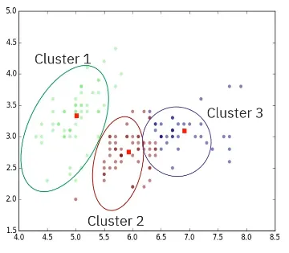

# Building Unsupervised Learning Models

# **Introduction to Clustering**

Clustering is a **machine learning technique** that automatically organizes data points into groups, known as **clusters**, based on their similarities. This method can use either a single feature or multiple features within a dataset to create meaningful groupings.

Clustering is an **unsupervised learning method**, which distinguishes it from supervised methods like classification. While classification algorithms learn from labeled data to predict categorical labels, clustering works with **unlabeled data**, independently identifying patterns to form groups. For instance, a supervised decision tree model might be trained on historical data to predict if a customer will default on a loan.

In contrast, an unsupervised k-means clustering model could segment customers with similar characteristics into different groups without any prior knowledge of their default status.

### **Applications of Clustering**

Clustering has a wide range of real-world applications across various domains:

- **General Use Cases**: It can be used for tasks like identifying music genres, segmenting user groups for targeted services, or analyzing different market segments.
- **Exploratory Data Analysis**: Clustering helps uncover natural groupings in data, such as segmenting customers for more effective marketing campaigns.
- **Pattern and Image Recognition**: By grouping similar objects, clustering aids in pattern recognition and image segmentation, which can be used for purposes like detecting medical abnormalities.
- **Anomaly Detection**: The technique can identify outliers that do not fit into any cluster, which is useful for detecting fraudulent activities or equipment malfunctions.
- **Feature Engineering and Data Reduction**: Clustering can be used to create new features or reduce the dimensionality of a dataset, which can improve a model's performance and interpretability. It also simplifies data by summarizing it into a few representative clusters.
- **Data Compression**: By replacing large sets of data points with their cluster centers, clustering can reduce the size of data, a technique useful in applications like image compression.

### **Types of Clustering Methods**

The sources describe three primary types of clustering methods:

- **Partition-Based Clustering**:
    - These algorithms divide data into a predefined number of non-overlapping groups.
    - The most common method is **k-means**, which aims to identify 'k' clusters with the minimum possible variance within each cluster.
    - Partition-based methods are known for being **efficient and scalable**, making them suitable for large datasets.
    - However, they can struggle with irregularly shaped data. For example, when applied to interlocking half-circle shapes, a partition-based algorithm had difficulty separating them correctly.
    
    
    
- **Density-Based Clustering**:
    - These algorithms can create clusters of **any shape**, making them ideal for datasets with irregular clusters or significant noise.
    - A prominent example of this type is the **DBSCAN** algorithm.
    - In an example with interlocking half-circles where partition-based clustering failed, density-based clustering successfully separated the shapes, though it also created a small, unnecessary third cluster.
    
    
    
- **Hierarchical Clustering**:
    - This method organizes data into a tree-like structure of nested clusters, where each cluster contains smaller sub-clusters.
    - The results are visualized using a **dendrogram**, which clearly shows the relationships and hierarchy between clusters. An example of this is a diagram created by UCLA biologists to show the genetic similarities among over 900 dogs and 200 wolves.
    
    
    
    - These algorithms are considered intuitive and are effective for small to mid-sized datasets.
    - There are two main strategies for building the hierarchy: **agglomerative (bottom-up)** and **divisive (top-down)**.
    
    
    

### **Hierarchical Clustering Strategies**

The two primary approaches to hierarchical clustering operate in opposite directions:

- **Divisive Hierarchical Clustering (Top-Down Approach)**:
    - This method starts with the entire dataset as a single large cluster.
    - It then **iteratively splits** this cluster into smaller child clusters based on dissimilarities.
    - The process of splitting continues until a stopping criterion is met, such as reaching a minimum cluster size.
- **Agglomerative Hierarchical Clustering (Bottom-Up Approach)**:
    - This method begins with each individual data point as its own cluster.
    - It then **iteratively merges** the two closest clusters into a new, larger parent cluster.
    - This process is repeated until all data points are merged into a single cluster or a desired number of clusters is achieved.
    - **The Algorithm Steps**:
        1. **Initialization**: Start with N clusters (one for each data point) and select a distance metric (e.g., distance between centroids).
        2. **Distance Matrix**: Compute an n-x-n matrix that contains the distances between every pair of points.
        3. **Merge**: Identify the two closest clusters in the distance matrix and merge them.
        4. **Update**: Update the distance matrix to reflect the newly formed cluster and its distances to all other clusters. This process is repeated until completion.
        
        
        
    - An example illustrates this by grouping six Canadian cities based on flight distances.
        
        
        
        The algorithm starts with six city-clusters, finds the closest pair (Montreal and Ottawa), merges them, updates the distance matrix, 
        
        
        
        and continues merging the next closest pairs (e.g., the new "Ottawa-Montreal" cluster and Toronto)
        
        
        
        
        
        until all cities are in one large cluster, with a dendrogram visualizing the entire process.
        
        
        
        
        

# **Definition and Goal of K-Means Clustering**

K-means is an **iterative, centroid-based clustering algorithm**. Its primary function is to split a dataset into a predefined number of non-overlapping groups, or clusters. The grouping is based on the similarity between data points, determined by the distance to a cluster's center, known as a **centroid**.

The algorithm aims to construct 'k' clusters that meet two main criteria:

- **Minimal within-cluster variance**: The data points within each cluster should be as close as possible to their centroid. The overall objective of K-means is **to minimize this variance across all clusters simultaneously**.
- **Maximum dissimilarity between clusters**: The clusters themselves should be distinct and well-separated from one another.

The number of clusters, 'k', is a parameter you must choose **beforehand**. A higher 'k' value will result in smaller clusters with more detail, while a lower 'k' will create larger, less detailed clusters.

## **The K-Means Algorithm Steps**

The K-means algorithm operates through an iterative process until it converges on a final set of clusters.

1. **Initialization**:
    - First, you must **choose the number of clusters (k)** you want to partition the data into.
    - Next, **randomly select 'k' initial starting locations for the centroids**. These can be actual data points from your dataset or other points within the feature space.
2. **Assignment and Update Loop**: This phase repeats until the centroids stop changing position.
    - **Compute Distances**: The algorithm calculates a distance matrix, which contains the distance from every data point to every centroid.
    - **Assign Points to Clusters**: Each data point is assigned to the cluster whose centroid is nearest to it.
    - **Update Centroids**: After all points are assigned, the centroid of each cluster is recalculated. The new centroid is the **mean (average position) of all the data points** currently assigned to that cluster.
3. **Convergence**:
    - The algorithm has converged when, after an iteration of assigning points and updating centroids, the **positions of the centroids no longer change**. This means the cluster assignments have stabilized.
    - Alternatively, the process can be stopped after a maximum number of iterations is reached. An experiment demonstrated that convergence can happen quickly; in the example, the centroids stopped moving by the third iteration.
    
    
    

### **Performance, Assumptions, and Limitations**

While K-means is **efficient and scales well to large datasets**, its performance is based on several key assumptions, which can also be its limitations.

- **Assumption of Convex Clusters**: K-means assumes that clusters are convex, meaning a straight line drawn between any two points in a cluster will stay within that cluster's boundary. This makes it perform poorly on non-convex or irregularly shaped data.

- **Assumption of Balanced Clusters**: The algorithm assumes that the clusters contain a roughly equal number of data points. It performs poorly on **imbalanced clusters** where one cluster is much larger than another. In an experiment with one cluster of 200 points and another of 10, the centroid of the smaller cluster drifted towards the larger one, incorrectly absorbing some of its points.

- **Sensitivity to Outliers**: Because K-means uses variance to form clusters, it can be negatively impacted by noise and outliers in the data.

## **K-Means Performance in Experiments**

Experiments illustrate how K-means behaves under different conditions:

- **Effect of Data Spread (Standard Deviation)**:
    - When clustering three distinct "blobs" of data, K-means performed well with low standard deviations (1 and 4), correctly identifying the three groups with minor errors where they overlapped.
    - With a very high standard deviation (15), the blobs became visually indistinguishable. K-means still followed instructions and created three clusters, even though the result was not meaningful.
    
    
    
    - A key observation is that **as the standard deviation of the data increases, the final cluster centroids that K-means finds tend to get closer together**.
- **Effect of an Incorrect 'k' Value**:
    - When K-means was asked to find two clusters (k=2) in data that naturally contained three, it correctly identified one of the blobs and merged the other two into a single cluster.
    
    
    
    - Using a 'k' value that is too large can lead to unacceptable results.
    
    
    

## **How to Determine the Optimal 'k'**

Choosing the right value for 'k' is a critical challenge, especially for complex, high-dimensional data where you cannot easily visualize the clusters. For 2D or 3D data, scatter plots can offer some visual insight into separability. For more complex cases, several heuristic techniques exist to help you gauge the performance of K-means for a given 'k':

- **Silhouette Analysis**: This method measures how similar a data point is to its own cluster (cohesion) compared to how different it is from other clusters (separation).
- **The Elbow Method**: This involves plotting the K-means objective function (the within-cluster variance) for different values of 'k' and looking for an "elbow" point where the rate of decrease sharply changes.
- **The Davies-Bouldin Index**: This metric calculates the average similarity ratio of each cluster with the cluster that is most similar to it.

# Introduction to Density-Based Clustering

Density-based clustering is an approach particularly **useful for datasets that contain noise and outliers, or when the total number of clusters is unknown**. Unlike centroid-based algorithms like k-means, which produce spherical clusters and assign every point to a cluster, **density-based methods can handle real-world data complexities**. Such complexities include patterns with **arbitrary shapes, shapes within shapes, and noise**.

This is achieved by identifying connected regions within the data that have a relatively high density.

Two key algorithms are DBSCAN and HDBSCAN.

- **DBSCAN** **(Density-Based Spatial Clustering of Applications with Noise)** is an algorithm that forms clusters based on a **density value provided by the user**. It can discover clusters of any shape, size, or density and can also differentiate between data points that belong to a cluster and those that should be considered noise.
- **HDBSCAN** **(Hierarchical Density-Based Spatial Clustering of Applications with Noise)** is a variant of DBSCAN.

## The DBSCAN Algorithm

The DBSCAN algorithm operates by defining neighborhoods around data points and classifying them based on the density within those neighborhoods.

### **Parameters**

To begin, the user must select two parameters:

1. **n**: The desired minimum number of points required to form a neighborhood.
2. **epsilon (ε)**: The radius that defines the size of each neighborhood.

### **Point Classification**

DBSCAN processes every point in the dataset, labeling each one as one of three types:

- **Core Point**: A central point within a cluster that has at least `n` points (including itself) within its epsilon radius.
- **Border Point**: A point that falls within the neighborhood of a core point but does not have enough neighbors to be a core point itself. These points exist in the "outer reaches" of the core neighborhoods.
- **Noise Point**: A point that is isolated and does not fall within the neighborhood of any core point. Any points that remain unassigned after the clustering process are considered noise.
    
    
    

### **Cluster Formation Process**

Clusters are formed in a single pass and are not updated once labeled, meaning **DBSCAN is not an iterative algorithm**. The process works as follows:

1. Clusters begin to grow from core points.
2. All neighbors of a core point, including border points, are included in that core point's cluster.
3. A simulation using "half-moons" data illustrates this process. Initially, all points are considered noise (labeled in black). The algorithm then identifies a cluster (e.g., blue points), followed by another (orange points), and a third isolated one (green points), leaving the remaining points unlabeled as noise.
This demonstrates DBSCAN's ability to cluster the data effectively while also identifying outliers.

## The HDBSCAN Algorithm

HDBSCAN is a more flexible variant of DBSCAN that is less sensitive to noise and outliers. It combines principles from both agglomerative and density-based clustering.

### **Key Features and Advantages**

- **Parameter Flexibility**: One of the main advantages of HDBSCAN is that it **doesn't require any parameters to be set**, unlike DBSCAN. However, for a specific application, parameters like a minimum number of samples and a minimum cluster size are used, suggesting some level of tuning is possible.
- **Adaptive Density**: HDBSCAN can **adaptively adjust the neighborhood size** to reflect local changes in data density.
- **Cluster Stability**: The algorithm uses the concept of **cluster stability**, which refers to a cluster's ability to persist and not change significantly as the neighborhood size (or distance threshold) is adjusted over a reasonable range. HDBSCAN measures this stability to find the best local neighborhood radii, leading to more robust and meaningful clusters.

### **How It Works**

The technical implementation of HDBSCAN is complex. The process involves:

1. Initially treating each point as its own individual cluster, or effectively as noise.
2. Progressively merging or agglomerating these small clusters into a hierarchy by incrementally lowering the density threshold.
3. This creates a hierarchical tree of clusters, which is then simplified into a "condensed tree" that retains only the most stable clusters found across the different density levels.

## DBSCAN vs. HDBSCAN: An Example

A comparison using a dataset of Canadian museum locations highlights the practical differences between the two algorithms.

- **DBSCAN's Performance**: When run with a minimum of 3 samples and a radius of 0.15, DBSCAN found about 10 clusters that appeared appropriate. However, in a region with much higher population density, it **lumped most of the points into a single large cluster**, failing to provide detailed insight.

- **HDBSCAN's Performance**: Using a minimum of 10 samples and a minimum cluster size of 3, HDBSCAN produced a more coherent and less noisy result. It identified **more distinct clusters** than DBSCAN and provided a greater level of detail, especially in the dense eastern region where DBSCAN struggled. Additionally, HDBSCAN successfully tracked and distinguished connected sets of points that formed curves.

By tuning its parameters, HDBSCAN allows a user to find a balance between capturing detail, managing outliers, and controlling the number of clusters found.

# Interplay of Clustering, Dimension Reduction, and Feature Engineering

Clustering, dimension reduction, and feature engineering are presented as **complementary techniques in machine learning and data science**. They are designed to work together **to** **enhance model performance, interpretability, and overall quality**.

- **Clustering** can aid in **feature selection and creation**. It also supports dimension reduction, which in turn boosts computational efficiency and scalability.
- **Dimension reduction** is useful for simplifying the visualization of high-dimensional clustering results. This simplification assists in feature engineering and leads to better model quality.

## Dimension Reduction

Dimension reduction is a process that **simplifies a data model by reducing the number of features** it requires. It is frequently used as a pre-processing step for clustering algorithms to simplify the data's structure and improve outcomes.

### **The Challenge of High-Dimensional Data**

High-dimensional data presents significant challenges for distance-based clustering algorithms such as k-means and DBSCAN. The core issue is that as **the number of dimensions (features) increases, the volume of the feature space expands rapidly**. This expansion causes data points to become sparse and less similar to one another. Consequently, this can result in the formation of smaller clusters and necessitates more data to fill the gaps between points.

### **Techniques**

To address these challenges, techniques like **Principal Component Analysis (PCA), t-SNE, and UMAP** are used **to reduce the number of dimensions before clustering is applied**. This pre-processing step enhances the efficiency of the clustering algorithms.

### Application of Dimension Reduction in Face Recognition

An example of using dimension reduction for a supervised face recognition task.

1. **Input Features**: The process uses **eigenfaces** as the input features.
2. **PCA Application**: PCA is performed on an unlabeled dataset of 966 faces to extract the **top 150 eigenfaces**.
3. **Feature Space**: These 150 eigenfaces establish an orthonormal basis for the feature space defined by the dataset.
4. **Model Training**: The input data is projected onto this new eigenface basis. An SVM is then trained to predict the faces.
5. **Benefits**: This method of dimensionality reduction effectively **preserves the key features necessary for identifying faces** while minimizing the computational load.
6. **Results**: The example demonstrates that this facial recognition task accurately predicted 12 different faces, and a chart was used to provide a quantitative evaluation of the model's quality.

### Visualizing High-Dimensional Clusters

Directly visualizing clustering results is not possible when working with feature spaces that have more than three dimensions. Dimension reduction techniques are crucial for overcoming this limitation.

- Advanced methods like **PCA, t-SNE, and UMAP can project clustering outcomes from high-dimensional spaces into two or three dimensions**, which significantly improves visual interpretation.
- This allows for the creation of scatter plots that help in visualizing the quality of the clustering.
- Furthermore, reducing data dimensionality often **enhances cluster interoperability**, making it easier to identify key patterns or relationships that might be obscured in higher dimensions.

### Clustering for Feature Engineering and Selection

Clustering techniques are versatile and can be applied not only to data observations but also directly to the features themselves.

### **Feature Selection**

By clustering features, you can identify groups of features that are similar or correlated, meaning they provide **redundant information**. From each of these clusters, a single representative feature can be chosen for the model. This process achieves feature selection by **reducing the total number of features while preserving valuable information**. This can also be considered a form of dimension reduction.

### **Feature Engineering**

The results of clustering can also inform feature engineering decisions. For example, if clusters in the data point to distinct subgroups, it might suggest that creating specific interactions between features or applying certain data transformations could be beneficial for a predictive model.

### Example: Feature Selection with K-Means

A simulation is described to illustrate how a clustering method like k-means can be used to cluster features.

- **Dataset**: The example uses five features, each generated with a random normal distribution but with different means (1, 5, and 10) and variances. Features 1, 2, and 3 were created to be statistically very similar, while features 4 and 5 were designed to stand out.
- **Clustering Process**: The k-means algorithm (with k=3) is run on the features themselves, not the data values.
- **Outcome**: The algorithm correctly groups the features. Cluster 1 contains the redundant features (1, 2, and 3).
- **Application**: For any modeling task with this dataset, you would want to **select only one of the features from this redundant cluster**. This serves as a practical example of implementing feature selection as part of the broader feature engineering process.

# Introduction to Dimension Reduction Algorithms

Dimension Reduction Algorithms are a set of techniques used in machine learning to **reduce the number of features in a dataset without sacrificing critical information**. High-dimensional data is often very difficult to analyze and visualize, and **these algorithms simplify the dataset for machine learning models**.

The primary goal is to transform the original dimensions of the data to create a new, smaller set of features. Three prominent algorithms are **Principal Component Analysis (PCA)**, **T-Distributed Stochastic Neighbor Embedding (t-SNE)**, and **Uniform Manifold Approximation and Projection (UMAP)**.

### Principal Component Analysis (PCA)

PCA is a **linear dimensionality reduction algorithm**. It is particularly effective when the features in a dataset are assumed to be **linearly correlated**.

- **Function**: PCA simplifies data, reduces its dimensionality, and helps to reduce noise, all while minimizing the loss of information.
- **Mechanism**: The algorithm transforms the original features into a new set of uncorrelated variables known as **principal components**. These components retain as much of the original data's variance as possible.
- **Principal Components**:
    - They are orthogonal to one another, defining a new coordinate system for the feature space.
    - They are organized in decreasing order of importance, based on how much of the feature space variance they explain.
    - Typically, the first few components contain most of the meaningful information, while the remaining components tend to represent noise.

### T-Distributed Stochastic Neighbor Embedding (t-SNE)

t-SNE is an algorithm that **maps high-dimensional data points into a lower-dimensional space**, often two or three dimensions for visualization.

- **Strengths**: It is very effective at finding clusters within complex, high-dimensional data, and it works well with data types like images and text.
- **Mechanism**: t-SNE **focuses on preserving the similarity between points that are close to each other in the original high-dimensional space**. This similarity is measured by the proximity, or distance, between pairs of points. It is less concerned with preserving the distances between points that are far apart.
- **Weaknesses**: The algorithm **does not scale well** to large datasets and can be **difficult to tune**, as its performance is sensitive to its hyperparameters.

### Uniform Manifold Approximation and Projection (UMAP)

UMAP is a **nonlinear dimensionality reduction algorithm** that is often used as an alternative to t-SNE. **It creates a low-dimensional representation of data by approximating the manifold on which the data is assumed to lie**.

- **Mechanism**: UMAP operates based on manifold theory, which posits that **the data lies on a lower-dimensional manifold that is embedded within the higher-dimensional space**. It first constructs a high-dimensional graph to represent the data and then optimizes a corresponding low-dimensional graph structure that best preserves the relationships between the original data points.
- **Advantages over t-SNE**:
    - **Scalability**: UMAP scales better to larger datasets than t-SNE.
    - **Structure Preservation**: In addition to preserving the local structure of the data (like t-SNE), UMAP also preserves the **global structure**.
    - **Performance**: It often achieves higher clustering performance compared to t-SNE.

### Comparative Example: Projecting 3D Data to 2D

An example using simulated 3D data to compare the performance of PCA, t-SNE, and UMAP when projecting the data onto two dimensions. The dataset consists of four "blobs" or clusters. Two of the blobs (yellow and purple) have a slight overlap, while the other two are distinctly separated from all others.

- **PCA Results**: PCA **separated the blobs effectively**. This outcome was expected because the blobs are linearly correlated, differing only in their means and variances, which is the ideal scenario for PCA.

- **t-SNE Results**: t-SNE successfully grouped the data into **four very distinct clusters**. While it mostly separated the blobs well, it did mislabel several points within the purple cluster that originated from the green and yellow clusters, which is consistent with the initial overlap in the data.

- **UMAP Results**: UMAP's projection showed that three of the clusters did not fully separate, with the yellow and green clusters having a slight overlap with the purple cluster. This result was considered **slightly better than t-SNE's** in this specific case because it more accurately reflected the original 3D data, where the yellow and purple clusters were not completely separated to begin with. In contrast, t-SNE created four very distinct clusters, which did not fully capture the nuance of the original data's structure.

# **Summary and Highlights**

- Clustering is a machine learning technique used to group data based on similarity, with applications in customer segmentation and anomaly detection.
- K-means clustering partitions data into clusters based on the distance between data points and centroids but struggles with imbalanced or non-convex clusters.
- Heuristic methods such as silhouette analysis, the elbow method, and the Davies-Bouldin Index help assess k-means performance.
- DBSCAN is a density-based algorithm that creates clusters based on density and works well with natural, irregular patterns.
- HDBSCAN is a variant of DBSCAN that does not require parameters and uses cluster stability to find clusters.
- Hierarchical clustering can be divisive (top-down) or agglomerative (bottom-up) and produces a dendrogram to visualize the cluster hierarchy.
- Dimension reduction simplifies data structure, improves clustering outcomes, and is useful in tasks such as face recognition (using eigenfaces).
- Clustering and dimension reduction work together to improve model performance by reducing noise and simplifying feature selection.
- PCA, a linear dimensionality reduction method, minimizes information loss while reducing dimensionality and noise in data.
- t-SNE and UMAP are other dimensionality reduction techniques that map high-dimensional data into lower-dimensional spaces for visualization and analysis.