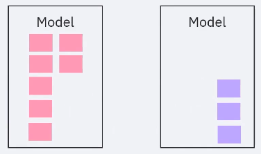
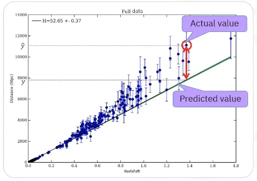
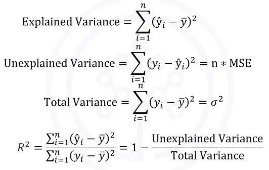
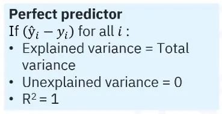
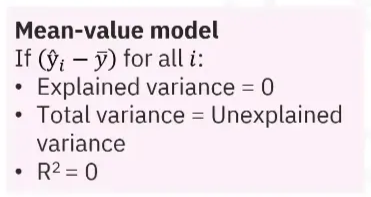
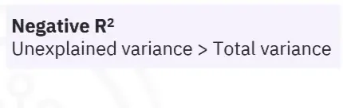
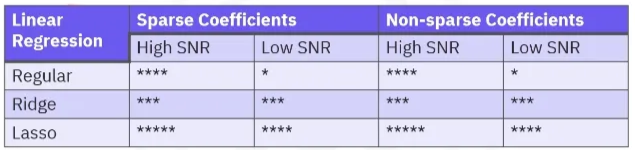
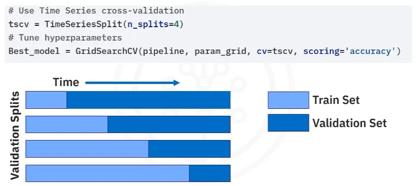

# Evaluating and Validating Machine Learning Models

# Classification Metrics and Evaluation Techniques

### I. Supervised Learning Evaluation and Model Preparation

**Supervised Learning Evaluation**

- Supervised learning evaluation establishes **how well a machine learning model can predict the outcome for unseen data**.
- It is essential for understanding model effectiveness.
- Evaluation involves comparing the model predictions to **ground truth labels**.
- The model is evaluated during the training phase (where it optimizes predictions based on one or more metrics) and again after training (to estimate generalization to unseen data).

**The Train-Test-Split Technique**

- This technique is used to **estimate the performance** of machine learning algorithms when they are utilized to make predictions.
- The dataset is split into two subsets: the **training set** and the **test set**.
- The **training subset** typically comprises around **70% to 80%** of the data and is used to train the model.
- The **test subset** is used to evaluate how well the model generalizes to new unseen data.

### II. Core Classification Metrics

In classification tasks, the model predicts categorical labels, and common metrics are used to assess how well these predictions align with the actual labels.

**Accuracy**

- Accuracy is defined as the **ratio of correctly predicted instances to the total number of instances** in the dataset.
- It is calculated by taking **the number of correctly classified observations** and dividing it by the **total number of observations**.
- *Example:*
A "pass-or-fail" test example resulted in an accuracy calculation of 70%.
    
    
    
    A KNN classifier predicting iris types achieved an accuracy of 93%.
    

**The Confusion Matrix**

- A confusion matrix is a table commonly used **for evaluating classification performance**.
- It breaks down the counts of ground truth instances of a specific class against the number of instances predicted for that class.
- The **y-axis** represents the true labels, and the **x-axis** represents the predicted labels.
- The numbers in the boxes are the counts for four essential components: **True Positives, True Negatives, False Positives, and False Negatives**.
    - **True Positive (TP):** Predicted pass, and it was pass.
    - **True Negative (TN):** Predicted fail, and it was fail.
    - **False Positive (FP):** Predicted pass, but it is actually fail.
    - **False Negative (FN):** Predicted fail, and it is actually pass.
- The **diagonal entries** in the confusion matrix (e.g., visualized in a heat map) represent the predictions the classifier got right.

**Precision**

- Precision measures **how many of the predicted positive instances are actually positive**.
- It is the fraction of true positives among all examples that were predicted to be positives.
- **Formula:** $\dfrac{\text{TP}}{\text{TP} + \text{FP}}$
- **Importance:** Precision may be more important than accuracy when the cost associated with a **false positive** is high.
    - *Example:* In a movie recommendation engine, promoting a movie that is a false positive (a user isn't interested) results in an additional cost with no benefit.
    
    
    

**Recall**

- Recall measures **how many of the actual positive instances are correctly predicted**.
- It is the fraction of true positives among all examples that were actually positive.
- **Formula:** $\dfrac{\text{TP}}{\text{TP} + \text{FN}}$
- *Example Calculation:* In the pass/fail example, recall for the pass class was 4 out of 7 total true pass observations, resulting in 57.1%.
- **Importance:** Recall may be a more important metric when **opportunity cost** is higher.
    - *Example:* In the medical field, it is crucial to account for **false negatives**, especially regarding patient health.
    
    
    
    **Error! FN = 2, so Recall = 4 / 4 + 2 = 66,7%**
    

### III. Combined Metrics

**F1 Score**

- The F1 score is used when precision and recall are **equally important**, and a user cannot try to optimize one over the other.
- It is defined as the **harmonic or balanced mean** of precision and recall.
- Formula: $2 \times \dfrac{\text{precision} \times \text{recall}}{\text{precision} + \text{recall}}$
- *Example:* A setosa prediction in an evaluation table scored perfectly at 1 for precision, recall, and F1 score.

- The **weighted average** of the classification metrics is weighted by the **support of each class** (i.e., the number of flowers in each class).

# **Regression Metrics and Evaluation Techniques**

### The Need for Regression Model Evaluation

Evaluating a regression model is necessary to determine **how accurately the model can predict continuous numerical values**, such as exam grades. It is crucial because regression models are **not foolproof** and frequently make prediction errors. The purpose of studying these techniques is to enable one to explain the need for evaluation, define model error, describe specific metrics, and compare different metrics.

### Defining and Characterizing Model Error

The **error of a model** is fundamentally a measure of the difference between the actual data points and the trend line generated by the algorithm.

- **Calculation of Error:** Errors are defined as the difference between the **predicted values minus the actual values**.

- **Example:** When predicting grades using a regression line, the differences between the line and the observed data points (blue dots) are considered the errors.
- **Variability:** Since there are multiple data points, the error can be determined in various ways.
- **Regression Metrics:** These metrics provide insight into a model’s performance, specifically revealing information about its **accuracy, error distribution, and error magnitude**.

### Essential Regression Metrics

There are **four metrics** considered most important in regression: **MAE**, **MSE**, **RMSE**, and **R-squared**.

### Error Metrics (MAE, MSE, RMSE)

- **MAE (Mean Absolute Error):** This is calculated as the **average absolute difference** between the values fitted by the model and the observed historical data.

- **MSE (Mean Squared Error):** This is the sum of the **squared difference** between the fitted values and observed values, divided by the number of historical points minus the number of parameters in the model.

- **RMSE (Root Mean Squared Error):** This is the **square root of the MSE**. It is a popular evaluation metric because it possesses the **same units as the target variable**, which makes it easier to interpret than MSE.

### Variance and Goodness of Fit Metrics

- **R-squared (Coefficient of Determination):** R-squared measures the model's **goodness of fit**. It represents the **amount of variance in the dependent variable that the independent variable can explain**. More specifically, it measures the **proportion of variance in the target variable that is predictable from the input variables**. R-squared is a simple measure that is readily understood by non-technical people (e.g., claiming a model explains 85% of the variation in the outcome).
    
    
    
- **Explained Variance:** This is calculated as the **sum of squared differences between the predictions and the average value of the actual target data**.
- **Total Variance ($\sigma^2$):** This measures the total variation of the target values from their mean value. For a perfect predictor, the explained variance is identical to the total variance of the target.

### Interpretation and Visualization of Results

### R-squared Interpretation

The values for R-squared range from **0 to 1**.

- **Perfect Model (R-squared = 1):** This occurs when the model perfectly predicts all data points (where the predicted value, $\hat{y}_i$, equals the actual value, $y_i$, for all $i$). In this scenario, the explained variance is identical to the total variance, and the unexplained variance is zero.
- **Badly Fit Model (R-squared = 0):** This happens if the model's predictions are extremely simplistic, such as constantly predicting the mean of the data for every data point. In this case, it explains no variance, the explained variance is zero, and the total variance is precisely the unexplained variance.
- **Real-World Models:** Values **between 0 and 1** are what should be expected, as a perfect model is not found in real life.
- **Negative R-squared:** A negative value indicates that the model performs so poorly that the unexplained variance exceeds the total variance.

⚠️ R-squared assumes that the target is **linearly related to the input features** and can be misleading when used for nonlinear models.

### Visualization

No single evaluation metric can provide a universally good measure of goodness of fit. Therefore, it is essential to **visualize your results** by plotting the actual and predicted values to see how well the regression model fits the labels.

### Example: Impact of Target Variable Transformation

An example demonstrated the results of fitting a linear regression model to a simulated target variable with an exponential distribution (log-normal distribution). The linear model was applied to three versions of the target variable:

1. The original target.
2. A Box-Cox transformed version of the target.
3. A logarithmically transformed version.
- **Visual Results:** Visually, it was observed that the models progressively fit the target data better with each transformation because the data became more concentrated around the best-fit line.

- **Metric Consistency:** The various evaluation metrics displayed (R-squared, MAE, MSE, and RMSE) were consistent with this visual intuition. The R-squared value **increased significantly** for both the Box-Cox and log transformations, and all error metrics (MAE, MSE, and RMSE) **improved substantially**.

# **Evaluating Unsupervised Learning Models: Heuristics and Techniques**

### Evaluation of Unsupervised Learning Models: Overview and Challenges

Unsupervised learning models, such as clustering and dimensionality reduction, aim to **discover hidden patterns and structures in data**. Evaluating these models poses unique challenges compared to supervised models because there are **no predefined labels or ground truths for training**.

- **Goal of Evaluation:** Evaluation methods assess the quality of the learned patterns and **how effectively the model groups similar data points**.
- **Subjectivity:** Unsupervised learning results are often **subjective**, requiring careful evaluation for consistency.
- **Evaluation Approach:** There is no single one-size-fits-all approach. Effective evaluation is crucial and often combines heuristics, domain expertise, metrics, ground truth comparisons, and visualization tools.
- **Stability:** It’s a crucial assessment of model reliability, ensuring the model performs similarly across varied data subsets or perturbations. For instance, **a stable clustering model will produce similar clusters despite changes in the dataset**.

### Clustering Evaluation Heuristics and Metrics

The goal of clustering is to group similar data points into clusters. Since predefined labels are lacking, various heuristics are employed to evaluate cluster quality.

**A. Types of Clustering Evaluation**
Evaluation techniques used for clustering include:

1. **Internal evaluation metrics:** These rely solely on input data.
2. **External evaluation metrics:** These utilize ground truth labels when they are available.
3. **Generalizability or stability evaluation:** This assesses cluster consistency across data variations.
4. **Visualization:** Dimensionality reduction techniques, such as scatter plots, are used for visualizing clustering outcomes.
5. **Cluster-assisted learning:** This involves refining clusters through supervised learning evaluations.
6. **Domain expertise:** It’s invaluable for interpreting results and providing feedback.

**B. Internal Clustering Evaluation Metrics**
These metrics assess clustering quality **based solely on the input data**:

- **Silhouette score:** This metric compares cohesion within each cluster to separation from others. It ranges from -1 to 1, with **higher values indicating better-defined clusters**. A silhouette plot shows coefficients for points within each cluster, combining the distance to the nearest neighboring cluster and the average distance to other points in the same cluster.
- **Davies-Bouldin index:** This measures the average ratio of a cluster's compactness to its separation from the nearest cluster. **Lower values indicate more distinct and compact clusters**.
- **Inertia (in k-means clustering):** This calculates the sum of variances within each cluster. **Lower values suggest more compact clusters**, but increasing the number of clusters inherently reduces variance, creating a tradeoff.

**C. External Clustering Evaluation Metrics**
These metrics utilize labeled or ground-truth data to evaluate quality **by comparing cluster labels with known classes**:

- **Adjusted Rand Index (ARI):** This measures the similarity between true labels and clustering outcomes, ranging from -1 to 1. A score of **1 indicates perfect alignment**, 0 **indicates random clustering**, and negative values **suggest performance worse than random**.
- **Normalized Mutual Information (NMI):** This quantifies the shared information between predicted cluster assignments and true labels on a scale from 0 to 1. **1 indicates perfect agreement**, and 0 **indicates no shared information**.
- **Fowlkes-Mallows Index:** This is defined as the geometric mean of precision and recall based on clustering and label assignments. A **higher score indicates better clustering performance**.

**D. Internal Clustering Examples (K-means on Simulated Blobs)**

1. **Distinct and Dense Clusters:** Results showed excellent quality, indicated by a high average silhouette score (0.84) and a low Davies-Bouldin index (0.22).

1. **Distinct but Dispersed Clusters:** Coefficients decreased rapidly as clusters spread out, leading to potential misassignments (indicated by a few negative values in the silhouette plot). Metrics suggested reasonable results, with a moderately high silhouette score (0.58) and a Davies-Bouldin index of 0.6.

### Dimensionality Reduction Evaluation

When using dimensionality reduction techniques (like PCA, t-SNE, or UMAP), it is crucial to evaluate how well the reduced data **retains important information**.

- **Explained variance ratio (in PCA):** This measures the variance captured by the principal components. It helps determine how many components are needed to achieve an acceptable cumulative explained variance.
- **Reconstruction error:** This assesses how accurately the original data can be reconstructed from the reduced representation. **Lower values indicate better information preservation**.
- **Neighborhood preservation:** This evaluates how well the relationships between data points in the high-dimensional space are maintained in lower dimensions. This is especially relevant for manifold learning algorithms like t-SNE and UMAP.

**A. Dimensionality Reduction Example (PCA on Iris Dataset)**
PCA analysis of the iris flower dataset, with points color-coded by species (setosa, versicolor, or virginica), allows for indirect visualization of classes using just two dimensions (PC1 and PC2), which is challenging with the original four features.

- **PC Dominance:** PC1 is dominant and nearly separates the clusters.

- **Variance:** The first two components typically account for most of the variance, with additional components adding little.

Effective model evaluation requires diverse metrics, subjective analysis, **domain expertise**, and **visual tools** (like scatter plots, dendrograms, and projection methods such as PCA, t-SNE, and UMAP) to properly interpret unsupervised learning results and assess patterns.

# Cross-Validation and Advanced Model Validation Techniques

Model validation focuses on doing the best to **optimize a model without jeopardizing its ability to predict well on unseen data**. Its primary goal is to **help prevent overfitting** when selecting the best model configuration by tuning hyperparameters. **Validation means tuning the model on the training data and only testing it on unseen test data once satisfaction is reached that the model is well trained**.

**Model Hyperparameters**
Most machine learning models utilize optional parameter settings known as **model hyperparameters**. These settings affect how well the model fits the data used to train it. 

Cross-validation is a technique that enables the tuning of these hyperparameters.

### Data Snooping and Data Leakage

Data snooping is a **critical validation error** defined as **checking performance on the test data before optimization of the model is complete**. Data snooping is considered a form of **data leakage**. If a user tries different hyperparameters and chooses the one that performs best on the testing data, the model is effectively fitted to the testing data rather than the training data. This process results in **overfitting**, which invalidates the model because it will likely not generalize well to truly unseen data.

**Prevention Strategy**
To prevent data snooping, it is necessary to **decouple model tuning from the final evaluation**.

### Data Segmentation Strategy (Train/Validate/Test Split)

To validate a model and ensure it does not overfit to the test data, a strategy involving segmenting the data into **at least three distinct parts** is necessary:

1. **Training Set:** This set is used to **train the model**, and this process **includes optimizing its hyperparameters**.
2. **Validation Set(s):** This refers to **one or more subsets** **of the training data** **used during the model optimization process**. These sets **are used to evaluate the machine learning model's performance while tuning**.
3. **Test Set:** This data is held back and **remains completely unseen during training and validation**. It is **used exclusively for the final evaluation after model training and validation are finished**.

### Cross-Validation (CV) Algorithm for Tuning

Cross-validation is the **technique that facilitates hyperparameter tuning**. The general algorithm for model tuning and validation involves several key steps:

1. Split the initial data into **training data** and **testing data**.
2. Further split the **training data** into a **training set** and a **validation set**.
3. Optimize the model's hyperparameters by **repeatedly training it on the training set** and measuring its performance on the **validation set**.
4. Choose **the best set of hyperparameters**.
5. Evaluate the resulting best model on the completely **unseen testing data**.

Following these steps yields a validated model along with an estimate of how well it will generalize on new unseen data.

### K-Fold Cross-Validation

**Limitations of Single Validation Sets**
Selecting a single, specific validation set presents potential validation problems. **The model could end up overfitting to that specific validation data set**. Furthermore, **if the model requires a substantial amount of data for training, there may not be enough data remaining for proper validation and testing**. If the **data is insufficient, the training and validation data might not accurately represent the sample population, and the model’s performance may be unstable across different validation sets**.

**K-Fold CV Solution and Mechanism**
K-fold cross-validation is a **solution designed to avoid overfitting the test data while optimizing hyperparameters**. K-fold CV is typically conducted using **5 to 10 folds** and provides a **more robust technique** for estimating the model's generalizability to unseen real-world data.

The mechanism involves:

1. Dividing the data into **K equal-sized folds** (subsets) to be used as validation subsets.
2. For each trial model or set of hyperparameters and for each fold:
    - Training a model on the remaining **K-1 folds**.
    - Testing the model on the **selected fold** and storing the model’s score.
3. Computing an **aggregated score** across all folds.
4. Selecting the **set of hyperparameters** that resulted in the best model.

**Benefits of K-Fold CV**
K-fold CV greatly increases the utilization of the data because **every data point is used both for training and validation**. Varying the validation set offers several benefits:

- It substantially increases the data upon which the model trains and tests.
- It reduces overfitting because it smooths out unwanted details that are particular to a chosen training subset.
- Consequently, it improves the ability to evaluate how well the model will generalize to unseen data.

### Techniques for Handling Data Imbalances and Skewness

**Stratified Cross-Validation (For Classification)**
Stratified cross-validation is used in **imbalanced classification problems**, which occur when **there are many observations in one class and very few in another**. This technique ensures that the **class distribution is preserved** in each validation fold. Preserving the distribution prevents bias in the evaluation process.

**Target Transformation (For Regression)**
The analog to imbalanced data in regression problems is when the **target variable is highly skewed**. Since many models assume the target is normally distributed, it may be beneficial to transform the target variable.

Methods such as **log-transforms** or **Box-Cox transforms** can be used to reduce the skewness and allow the model to fit the transformed target. These transformations can significantly reduce skewness, making it easier for models, like linear regression, to fit the resulting representation of the target variable.

# Regularization Definition and Purpose

**Regularization** is a technique used in regression to **prevent overfitting**. It works by applying constraints to the model during the training phase, discouraging it from fitting too closely to the training data. The primary mechanism through which regularization achieves this is by **suppressing the size of the model's coefficients**. Regularization techniques can be used in conjunction with linear regression to mitigate errors caused by noise and sensitivity to outliers.

**The Regularized Cost Function:**
Optimization in a regularized model uses a modified cost function with the general form:

$$
\text{Regularized Cost Function} = \text{Mean Squared Error} + \lambda \times \text{Penalty Term}
$$

## Ordinary Linear Regression

**Definition and Goal:**
Linear regression is a model that determines the relationship between two or more variables by fitting a straight line to the dataset. In ordinary linear regression, predictions are constructed as a linear combination of features. The objective is to minimize the **loss function**, which is usually measured as the **Mean Squared Error (MSE)** between the actual and predicted target values.

**Mathematical Representation:**
The linear regression model is mathematically defined by the linear combination:

$$
\hat{y} = \theta_0 + \theta_1 x_1 + \theta_2 x_2 + \dots + \theta_n x_n
$$

- $x_i$ represents the feature vectors, which can be part of a matrix $X$.
- The matrix $X$ includes a constant value of 1 in the first entry to account for the bias or intercept term, $\theta_0$.
- The $\theta_i$ terms are the **unknown weights**, also known as the **coefficients** of the model.

**Limitations:**
Ordinary linear regression has **no penalty term** in its cost function. It is sensitive to noisy data and outliers, leading it to **suffer from overfitting** in the presence of noise. In simulations with a low **Signal-to-Noise Ratio (SNR)**, linear regression performs very poorly, tending to greatly overestimate the ideal coefficients, overshoot zero coefficients, and assign large negative coefficients when they should be zero.

## Ridge and Lasso Regression Methods

Ridge and Lasso are **regularized forms of linear regression** that are differentiated solely by the specific penalty terms used in their cost functions.

| Feature | Lasso Regression (Least Absolute Shrinkage and Selection Operator) | Ridge Regression |
| --- | --- | --- |
| **Penalty Type** | **L1** or **sum-of-absolute-values penalty** on its coefficients | **L2** or **sum-of-squares penalty** on its coefficients |
| **Coefficient Impact** | Can shrink some coefficients to **exactly zero** | Helps to **shrink** the coefficients |
| **Key Use** | **Feature selection** and data compression tasks | General regularization |
| **Feature Sparsity** | Responds well to **feature sparsity**; effectively finds zero coefficients exactly | Less effective at finding zero coefficients than Lasso |

**Note on Sparsity:** In machine learning, sparse coefficients mean that **only a small number of variables significantly contribute to the dataset**, **while the rest have minimal or no impact**. Lasso's ability to drive coefficients to exactly zero makes it an excellent feature selector, even in low SNR environments.

## Comparative Performance Summary

Based on simulated results comparing Linear, Ridge, and Lasso regression methods in various environments:

- **Overall Performance:** **Lasso performs the best** out of the three methods in all scenarios tested (sparse/non-sparse coefficients with high/low SNR). In one test involving a moderately noisy target variable, Lasso's MSE was approximately **30 times less** than the MSEs of Ridge and regular linear regression.

- **High SNR Environment:** All three methods predict non-zero coefficients very well. Linear and Ridge have some difficulty predicting the zero coefficients, while Lasso finds them exactly.
    
    
    
- **Low SNR Environment:** Linear regression performs very poorly. **Lasso and Ridge are clear winners**. Lasso generally exhibits similar abilities to Ridge in predicting non-zero coefficients but is significantly better at finding the zero coefficients. However, for non-sparse data in a low SNR environment, Ridge slightly outperforms Lasso in predicting non-zero coefficients.

- **Noisy Data:** Ordinary linear regression is sensitive to noisy data and performs poorly in low SNR environments. Regularization techniques are necessary to mitigate errors caused by noise.

# Data Leakage and Data Snooping

## **Data Leakage**

**Data leakage** **occurs when a model's training data includes information that would not be available in the real world or unseen data after deployment**. This deceives the model, causing it to perform misleadingly well during training and validation. Since the test dataset contains the leaked data, evaluation will fail to detect poor generalizability until the model is implemented into production.

An illustrative example involves training a model to predict house prices where a feature is engineered using the average of the actual home prices over the entire dataset. **The model performs well on test data because it was taught using data leaked from the future that it cannot access in production.**

## **Data Snooping**

**Data snooping occurs when the training set contains information about the testing set, or the model accesses data it should not have.** This can happen by including future information, such as using tomorrow's stock price to predict today's outcome. **It can also occur when engineering new features using the entire dataset.**

### Mitigation Measures for Data Leakage

To mitigate the risk of data leakage, careful measures must be taken:

1. **Data Separation and Feature Selection:**
    - You must carefully select training and testing data to ensure future data does not leak into the training data.
    - Ensure proper separation between the training, validation, and test sets, avoiding overlap or contamination.
    - Avoid using features derived from the entire dataset, such as **global averages or other statistics**.
    - Ensure that features contain information that will actually be available when making real-world predictions with the deployed model.
2. **Data Processing Pipelines:**
    - Data processing pipelines should be run **independently** on the training and testing data.
3. **Cross-Validation and Hyperparameter Tuning:**
    - Pay attention to how cross-validation is implemented to ensure data is not leaking across different validation folds.
    - To avoid leakage when tuning hyperparameters using cross-validation, the pipeline should be **fit separately to each training fold** and then the resultant fitted pipeline applied to its corresponding validation fold.

## Handling Time-Dependent Data

When dealing with temporal data where the order of data points in time is crucial, **randomly splitting** the data into training and test sets must be avoided.

- **Required Split:** Data must be split into **sequential** training and testing sets, ensuring the training set always precedes the test set.
- **Time-Series Split:** When using cross-validation with time-dependent data, a **time-series split** should be used instead of the usual train-test split.
- **Implementation Example:** Scikit-learn's `time-series-split` (TSCV) can be used during hyperparameter tuning by setting `CV` equal to `TSCV` in `grid-search-cv`.
- **Mechanism of TSCV:** This method splits the data, retaining its temporal order (e.g., into four equal-sized folds). Each split uses a portion of the past data for training and the remaining future data for validation. The training set **expands** to include more data with each split, while the test set **shrinks**.

## Feature Importance Interpretation Pitfalls

Identifying common pitfalls and assessing feature importances provided by a trained machine learning model is essential.

Common pitfalls include:

1. **Shared Importances (Redundancy):** Highly correlated or redundant features used in modeling result in shared importances, which lowers their apparent influence.
2. **Blind Selection:** Blindly selecting what appears to be the most important features for subsequent modeling can degrade the results.
3. **Scale Sensitivity:** Some algorithms, like linear regression, do not naturally account for the scale of features, which can distort importance rankings if the data is unskilled.
4. **Correlation vs. Causation:** Feature importance indicates **correlation, not causation**. Important features do not necessarily drive outcomes.
5. **Feature Interactions:** Some models rank individual feature importance without accounting for interactions, potentially underestimating or overestimating their combined impact.
    - For example, if two separate features seem unimportant in linear regression, but their interaction (product) boosts performance, a non-linear algorithm like random forest regression could implicitly detect this interaction. In this case, linear regression would erroneously find the separate features unimportant, while random forest would share their importance, obscuring the crucial explanatory variable (their product).

## Other Common Modeling Pitfalls

A variety of other modeling pitfalls should be considered:

1. **Feature Selection/Transformation:** Using raw data without appropriate feature selection or transformation prevents the discovery of the optimal model.
2. **Evaluation Metrics:** Choosing the wrong evaluation metric or misinterpreting metrics can mislead the evaluation.
3. **Class Imbalance:** Failing to address class imbalances in classification problems biases predictions towards the majority classes.
4. **Automation Reliance:** Automated machine learning tools are powerful, but users still need to understand their data and the model the system creates.
5. **Causal Relationships and What-If Scenarios:** If the model lacks features that have a **causal impact** on the target variable, "what-if" scenarios generated by the model may be invalid. Without causal relationships, predictions based on hypothetical changes can be highly misleading or inaccurate.

# Summary and Highlights

- Supervised learning evaluation assesses a model's ability to predict outcomes for unseen data, often using a train/test split to estimate performance.
- Key metrics for classification evaluation include accuracy, confusion matrix, precision, recall, and the F1 score, which balances precision and recall.
- Regression model evaluation metrics include MAE, MSE, RMSE, R-squared, and explained variance to measure prediction accuracy.
- Unsupervised learning models are evaluated for pattern quality and consistency using metrics like Silhouette Score, Davies-Bouldin Index, and Adjusted Rand Index.
- Dimensionality reduction evaluation involves Explained Variance Ratio, Reconstruction Error, and Neighborhood Preservation to assess data structure retention.
- Model validation, including dividing data into training, validation, and test sets, helps prevent overfitting by tuning hyperparameters carefully.
- Cross-validation methods, especially K-fold and stratified cross-validation, support robust model validation without overfitting to test data.
- Regularization techniques, such as ridge (L2) and lasso (L1) regression, help prevent overfitting by adding penalty terms to linear regression models.
- Data leakage occurs when training data includes information unavailable in real-world data, which is preventable by separating data properly and mindful feature selection.
- Common modelling pitfalls include misinterpreting feature importance, ignoring class imbalance, and making causal inferences without sufficient evidence.”
- Feature importance assessments should consider redundancy, scale sensitivity, and avoid misinterpretation, as well as inappropriate assumptions about causation.